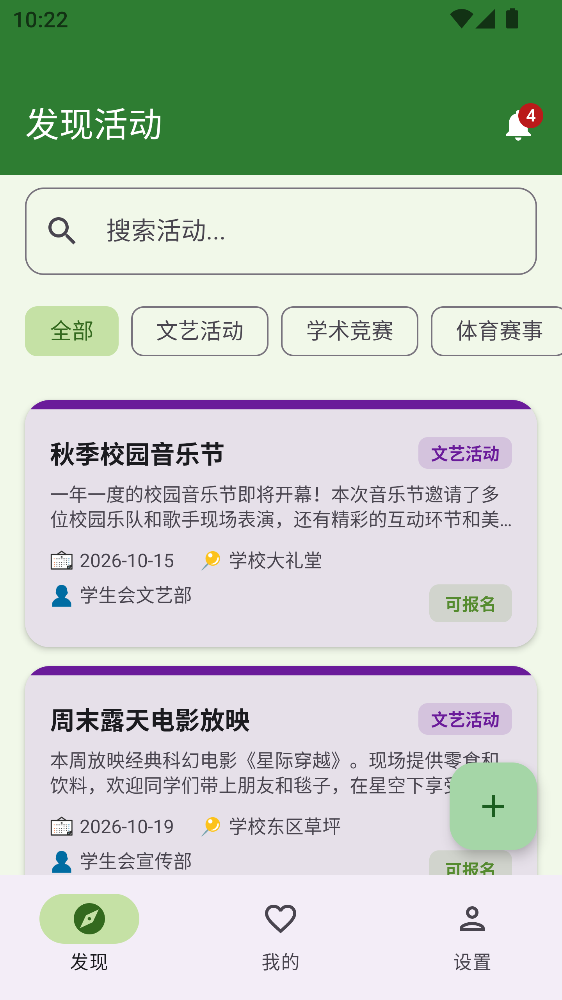
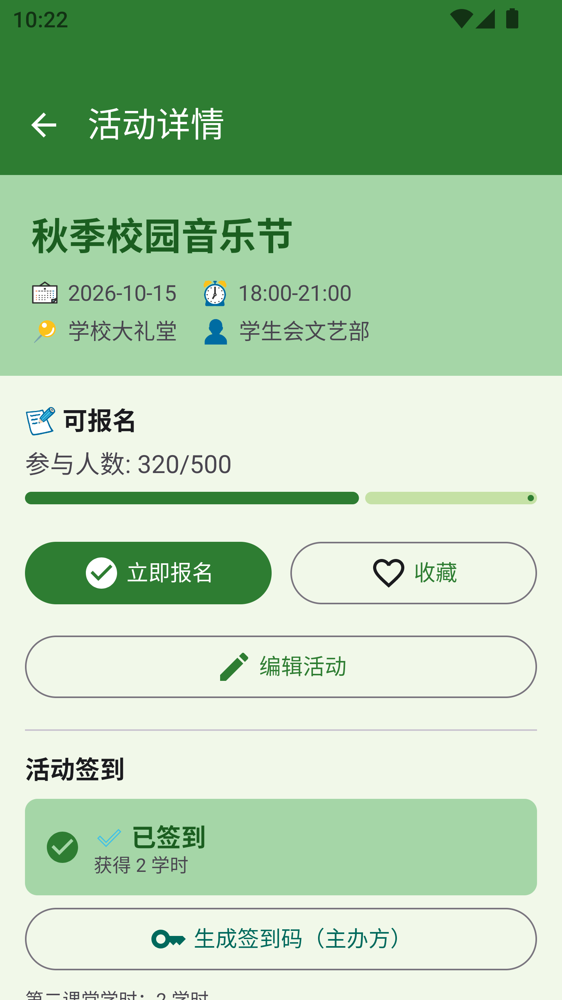
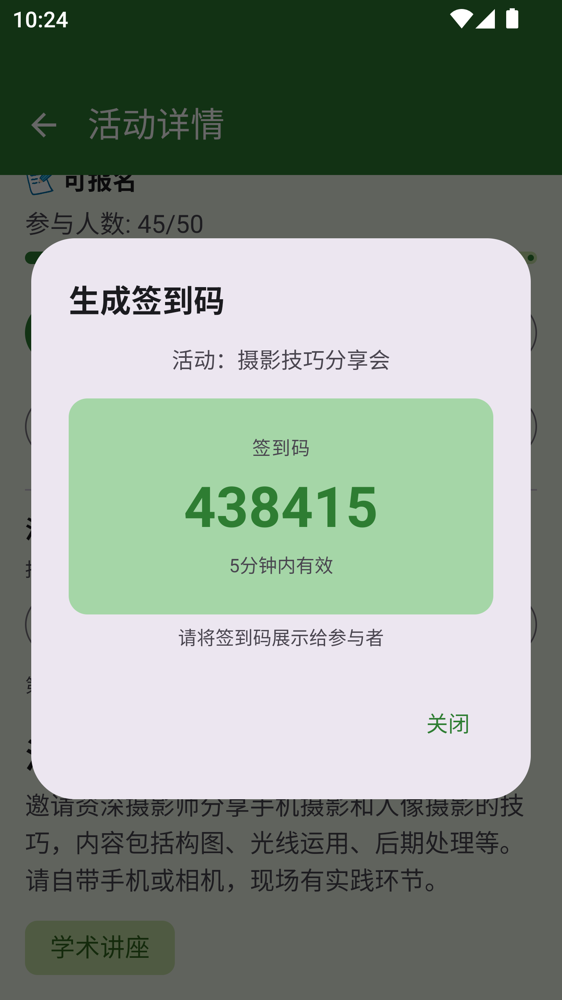
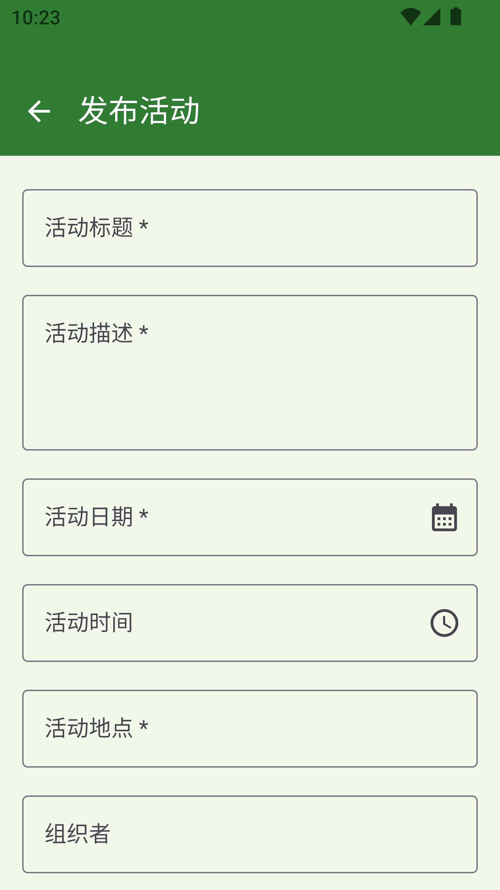
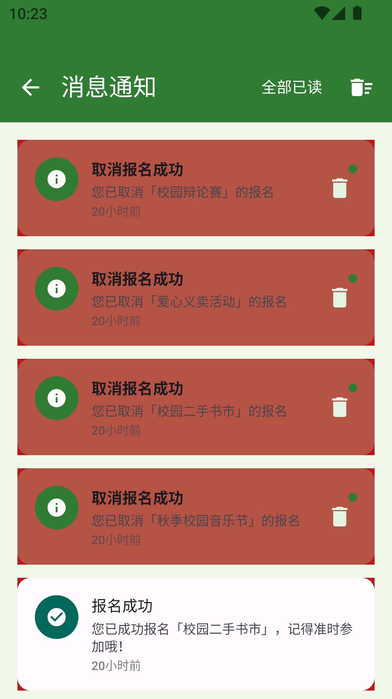
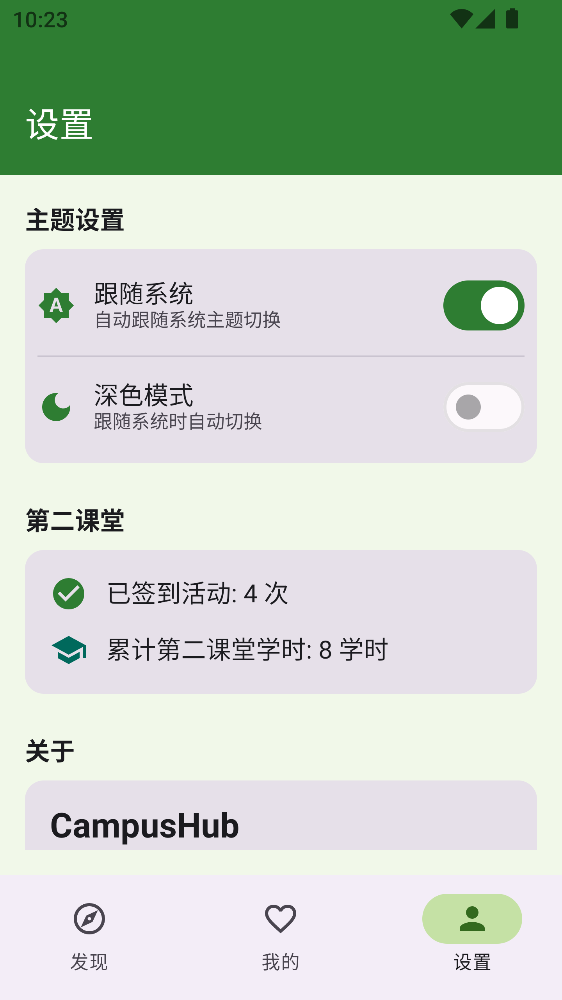

# CampusHub - 校园活动助手

GitHub 仓库地址：https://github.com/Wangzping/2025003002-FinalProject

## 1. 项目简介

- **应用名称**：CampusHub（校园活动助手）
- **目标用户**：在校大学生，需要浏览、报名、发布校园活动并获取第二课堂学时的全体师生
- **核心功能**：
  - 浏览校园活动列表，按类别筛选和搜索活动
  - 查看活动详情，报名参加或取消报名
  - 收藏感兴趣的活动
  - 发布新的校园活动（含日期/时间选择器）
  - 编辑已发布的活动信息
  - 管理已报名和收藏的活动
  - 活动签到（主办方生成6位签到码，参与者输入签到码签到）
  - 第二课堂学时统计（签到后获得对应学时，设置页展示汇总）
  - 活动开始前提醒（WorkManager 每小时后台检测并发送通知）
  - 活动更新通知（编辑活动后自动发送变更通知）
  - 消息通知中心（通知列表、已读/未读标记、滑动删除）
  - 深色模式切换（跟随系统/手动）

## 2. 技术栈

- UI：Jetpack Compose + Material 3
- 数据库：Room（5张表）
- 网络：Retrofit + OkHttp + MockInterceptor（Mock API）
- 状态管理：ViewModel + StateFlow
- 持久化偏好：DataStore
- 导航：Navigation Compose（6个路由）
- 异步处理：Kotlin Coroutines
- 后台任务：WorkManager（活动提醒）
- JSON 解析：Gson
- 依赖注入：手动 AppContainer

## 3. 功能清单

### 必做项完成情况

**UI 层**
- [x] Jetpack Compose 构建全部 UI
- [x] 至少 2 个主要页面（6个页面：发现、我的活动、设置、详情、发布、通知）
- [x] Compose Navigation 导航（底部3 Tab + 3个子页面）
- [x] LazyColumn 列表（发现页、我的活动页、通知页）
- [x] Material 3 组件和主题（自定义绿色校园主题）
- [x] 浅色/深色模式支持（跟随系统 + 手动切换）

**数据层**
- [x] Room 数据库，至少 2 张表（5张表：activities、user_activities、notifications、check_in_codes、check_in_records）
- [x] 完整 CRUD 操作
- [x] DAO 查询方法返回 Flow 类型
- [x] 至少一种查询功能（LIKE模糊搜索 + 按类别筛选 + 按日期排序 + 统计查询）
- [x] DataStore 保存用户偏好（主题偏好、分类筛选）

**网络层**
- [x] 声明并使用 Internet 权限
- [x] 使用网络请求获取 Mock API 数据（Retrofit + OkHttp + MockInterceptor）
- [x] 网络数据在核心页面中展示（发现页所有活动数据来源于网络层）
- [x] 处理 Loading / Success / Error 等网络状态（详情页3种状态）
- [x] Composable 不直接发起网络请求（通过 ViewModel → Repository → NetworkDataSource）

**架构层**
- [x] ViewModel 状态管理（6个ViewModel）
- [x] Repository 模式（4个Repository）
- [x] StateFlow / Flow 数据流
- [x] Kotlin 协程异步处理
- [x] UiState 描述界面状态（sealed interface，5组UiState）
- [x] Composable 不直接访问数据库或网络

**功能完整性**
- [x] 新增 / 编辑 / 删除 / 搜索等核心操作（报名、收藏、创建活动、编辑活动、搜索、筛选、签到、取消报名，共8项）
- [x] 输入验证和错误提示（创建活动必填检查、学时数字校验、Snackbar 提示）
- [x] 状态展示（空/加载/错误状态齐备）
- [x] 屏幕旋转后状态保持

### 选做项完成情况

- [x] 复杂数据库查询：LIKE模糊搜索、多表联合查询、COUNT统计、范围查询、Flow组合查询
- [x] WorkManager 后台任务：ActivityReminderWorker 每小时检测即将开始的活动
- [x] 网络缓存：网络数据优先，失败时自动回退本地 MockDataSource
- [x] 搜索体验优化：实时搜索，输入即搜索
- [x] 滑动删除：通知页支持侧滑删除
- [x] 依赖注入：手动 AppContainer 模式

## 4. 数据库设计

### 表 1：activities（活动表）

| 字段名 | 类型 | 说明 |
|---|---|---|
| id | Int | 主键 |
| title | String | 活动标题 |
| description | String | 活动描述 |
| date | String | 活动日期（yyyy-MM-dd） |
| time | String | 活动时间（HH:mm-HH:mm） |
| location | String | 活动地点 |
| organizer | String | 组织者 |
| category | String | 活动类别 |
| max_participants | Int | 最大参与人数（0表示不限） |
| current_participants | Int | 当前参与人数 |
| image_url | String? | 活动图片URL |
| credit_hours | Int | 第二课堂学时（默认2） |
| start_time | Long | 活动开始时间戳 |
| created_at | Long | 创建时间戳 |

### 表 2：user_activities（用户活动关系表）

| 字段名 | 类型 | 说明 |
|---|---|---|
| id | Int | 主键，自增 |
| activity_id | Int | 活动ID（唯一索引） |
| status | String | 状态（registered=已报名, favorite=已收藏） |
| created_at | Long | 创建时间戳 |

### 表 3：notifications（通知表）

| 字段名 | 类型 | 说明 |
|---|---|---|
| id | Int | 主键，自增 |
| title | String | 通知标题 |
| content | String | 通知内容 |
| type | String | 通知类型（info/success/warning/error） |
| activity_id | Int? | 关联活动ID |
| is_read | Boolean | 是否已读 |
| created_at | Long | 创建时间戳 |

### 表 4：check_in_codes（签到码表）

| 字段名 | 类型 | 说明 |
|---|---|---|
| id | Int | 主键，自增 |
| activity_id | Int | 关联活动ID |
| code | String | 6位签到码 |
| created_at | Long | 创建时间戳 |
| expires_at | Long | 过期时间戳 |
| is_active | Boolean | 是否有效（1=有效, 0=已失效） |

### 表 5：check_in_records（签到记录表）

| 字段名 | 类型 | 说明 |
|---|---|---|
| id | Int | 主键，自增 |
| activity_id | Int | 关联活动ID（索引） |
| check_in_time | Long | 签到时间戳 |
| duration | Int | 参与时长（分钟，按学时折算） |

### 表关系说明

- `user_activities.activity_id` → `activities.id`：用户与活动的多对多关系
- `notifications.activity_id` → `activities.id`：通知可关联活动（可选）
- `check_in_codes.activity_id` → `activities.id`：签到码关联活动
- `check_in_records.activity_id` → `activities.id`：签到记录关联活动

### 主要 DAO 查询方法

- `getAllActivities()`：按日期升序获取所有活动（返回 Flow）
- `getActivitiesByCategory(category)`：按类别筛选活动
- `searchActivities(query)`：标题和描述 LIKE 模糊搜索
- `getActivitiesStartingInRange(start, end)`：按时间范围查询即将开始的活动
- `incrementParticipants(id)` / `decrementParticipants(id)`：更新参与人数
- `getUserActivitiesByStatus(status)`：按状态获取用户活动
- `countByActivityId(activityId, status)`：检查用户是否已报名/收藏
- `getUnreadCount()`：未读通知统计
- `getActiveCode(activityId, now)`：获取指定活动的有效签到码
- `hasCheckedIn(activityId)`：检查是否已签到

## 5. 网络功能设计

- **API 来源**：Mock API（内置于 App，通过 OkHttp 拦截器模拟网络请求，含300ms网络延迟）
- **接口地址**：`https://api.campushub.com/api/activities`（本地 Mock，无需真实服务器）
- **请求方式**：Retrofit + OkHttp + GET 请求
- **主要返回字段**：
  ```json
  {
    "code": 200,
    "message": "success",
    "data": [
      {
        "id": 1,
        "title": "秋季校园音乐节",
        "description": "一年一度的校园音乐节即将开幕...",
        "date": "2026-10-15",
        "time": "18:00-21:00",
        "location": "学校大礼堂",
        "organizer": "学生会文艺部",
        "category": "文艺活动",
        "max_participants": 500,
        "current_participants": 320,
        "image_url": "/placeholder_music.jpg",
        "created_at": 1728000000000
      }
    ]
  }
  ```
- **App 中使用网络数据的页面**：
  - 发现页（首页）：展示从网络获取的活动列表，支持搜索和筛选
  - 详情页：展示单个活动的完整信息
- **网络失败时的处理方式**：当 Retrofit 请求失败时，Repository 自动回退到本地 MockDataSource 提供数据，确保 App 仍能正常运行。用户对此过程无感知。

## 6. 架构设计

项目采用 MVVM + Repository 架构，分为以下四层：

```
┌──────────────────────────────────────────────────────┐
│  UI Layer (Composable)                               │
│  ExploreScreen / DetailScreen / SettingsScreen ...   │
│  collectAsStateWithLifecycle() → 触发用户事件          │
├──────────────────────────────────────────────────────┤
│  ViewModel Layer                                     │
│  ExploreViewModel / DetailViewModel / ...            │
│  sealed interface UiState (Loading/Success/Error)     │
│  StateFlow 暴露状态，处理用户交互逻辑                   │
├──────────────────────────────────────────────────────┤
│  Repository Layer                                    │
│  ActivityRepository / NotificationRepository / ...    │
│  协调 NetworkDataSource (网络) 和 Room (本地缓存)       │
├──────────────────────────────────────────────────────┤
│  Data Layer                                          │
│  ├─ Network: ApiService(Retrofit) → MockInterceptor   │
│  │            → NetworkDataSource → DTO                │
│  └─ Local: RoomDatabase → DAO → Entity                │
│         DataStore → UserPreferences                    │
└──────────────────────────────────────────────────────┘
```

**数据流示例（报名活动）**：
1. 用户在详情页点击"立即报名"
2. DetailViewModel 调用 `activityRepository.register(activityId)`
3. Repository 检查名额是否已满、是否已报名
4. 写入 Room 数据库（user_activities 表 + 更新 participants 计数）
5. Room 的 Flow 自动通知 UI 更新
6. "我的活动"页通过 `combine` 监听两个 Flow，自动显示最新报名数据

**数据流示例（签到流程）**：
1. 主办方在详情页点击"生成签到码"，生成6位随机码存入 Room
2. 参与者报名后在详情页点击"输入签到码"，输入验证
3. CheckInRepository 检查签到码是否有效（未过期、未失效）
4. 验证通过后写入签到记录表，更新活动详情页签到状态
5. 设置页统计已签到次数和累计学时（页面可见时自动刷新）

## 7. 核心功能截图

### 发现页

说明：展示所有校园活动列表（来自Mock API），每张卡片显示标题、类别标签、日期、地点、组织者和参与状态。顶部有搜索框和类别筛选器，右上角显示未读通知数量角标。

### 活动详情页

说明：显示活动的完整信息，包括标题、日期时间、地点、组织者、参与人数进度条、第二课堂学时。底部有"立即报名""收藏""编辑活动"按钮；已报名后增加签到区域。

### 签到码生成

说明：主办方点击"生成签到码"后，弹出对话框显示6位签到码（5分钟内有效），参与者输入该码完成签到。

### 发布活动页

说明：表单包含标题、描述、日期（原生日期选择器）、时间（原生时间选择器）、地点、组织者、类别下拉选择、人数和学时输入，带有输入验证，必填项为空时提示错误。

### 通知页

说明：展示所有通知消息，支持已读/未读标记、全部已读、清空全部和滑动删除。未读通知显示小红点。

### 设置页

说明：深色模式切换（跟随系统/手动）、第二课堂统计（签到次数和累计学时）、关于信息。

## 8. 技术难点与解决方案

### 难点 1：Gradle 下载超时与构建配置

- **问题描述**：首次构建项目时，Gradle 从 `services.gradle.org` 下载极慢甚至超时；同时验证分发版时需要下载 `gradle-8.9-src.zip`，连接超时导致构建失败。
- **原因分析**：国内网络访问国外 Gradle 服务器不稳定；Gradle wrapper 配置了 `validateDistributionUrl=true`，验证过程中会从官方源下载 src.zip。
- **解决方案**：
  - Gradle 下载地址改为腾讯云镜像 `mirrors.cloud.tencent.com/gradle`
  - Maven 依赖使用阿里云镜像 `maven.aliyun.com/repository/public`
  - 将 `validateDistributionUrl` 设为 `false`，关闭分发版校验，避免下载 src.zip
- **参考资料**：Gradle 官方文档 - Wrapper 配置

### 难点 2：Room 数据库列名与 SQL 查询一致性

- **问题描述**：编译时提示 `[SQLITE_ERROR] no such column`，运行时 Room 查询失败。
- **原因分析**：Entity 中使用 `@ColumnInfo(name = "current_participants")` 指定蛇形列名，但 DAO 的自定义 SQL 中错误地使用了 Kotlin 驼峰属性名。
- **解决方案**：将所有 DAO 自定义 SQL 中的列名改为与 `@ColumnInfo` 定义一致的数据库实际列名。

### 难点 3：Flow 组合查询与数据刷新

- **问题描述**：详情页报名后，"我的活动"页不自动刷新已报名的活动列表。
- **原因分析**：初始实现使用嵌套 `collect` 导致数据流混乱，外层 collect 每发射一次就启动新的内层 collect。
- **解决方案**：改用 Kotlin Flow 的 `combine` 操作符同时监听多个 Flow，任一数据变化时自动组合并更新状态。

### 难点 4：Compose 实验性 API 兼容

- **问题描述**：使用 `ExposedDropdownMenuBox`（@OptIn 实验性 API）时出现编译警告，需要给多个 Composable 函数添加注解。
- **原因分析**：ExposedDropdownMenuBox 在 Material 3 中标记为实验性 API，每个使用它的 Composable 都需要 `@OptIn(ExperimentalMaterial3Api::class)`。
- **解决方案**：在 EditActivityDialog 和 CreateActivityScreen 的 Composable 函数上添加 `@OptIn(ExperimentalMaterial3Api::class)` 注解。

## 9. AI 使用说明

- [ ] 未使用 AI
- [ ] 网页版 AI（如 ChatGPT、Claude、Kimi、豆包等）
- [x] AI Agent / 编程代理（如 Claude Code、Codex、OpenCode、Cursor Agent 等）
- [x] 国产大模型服务（如 DeepSeek、GLM、通义千问、文心一言等）
- [x] IDE 插件或代码补全工具（如 GitHub Copilot、Cursor、CodeGeeX 等）
- [ ] 其他：

**具体工具名称**：DeepSeek-V4-Flash（代码生成与调试）、CodeBuddy（AI 编程代理）

**AI 主要用于哪些环节**：项目框架搭建、功能代码生成（签到系统、通知系统、日期选择器等）、Bug 调试（Gradle 构建异常、Room 查询错误、Flow 嵌套问题、Compose 实验性API等）、项目结构优化、实验报告整理。

**说明**：使用 AI Agent 完成代码框架搭建和调试，核心业务逻辑（报名流程、数据库设计、网络层架构、签到验证）在 AI 辅助下由本人设计和验证。使用 AI 主要提升了开发效率，所有代码逻辑均经过本人理解和测试。

## 10. 运行说明

- **最低 Android 版本**：API 24（Android 7.0）
- **推荐 Android 版本**：API 34（Android 14）
- **特殊权限**：网络权限（`android.permission.INTERNET`）
- **运行步骤**：
  1. 克隆仓库：`git clone https://github.com/Wangzping/2025003002-FinalProject`
  2. 使用 Android Studio 打开项目
  3. 等待 Gradle 同步完成（已配置腾讯云 Gradle 镜像和阿里云 Maven 镜像加速下载）
  4. 连接模拟器或真机，点击 Run
  5. 无需任何额外配置，App 启动后自动加载 Mock 校园活动数据

## 11. 项目亮点

1. **完整的网络架构**：虽然是 Mock API，但完整实现了 Retrofit + OkHttp + 协程的调用链路，包括网络延迟模拟（300ms）、数据序列化/反序列化、网络失败自动回退机制。
2. **响应式数据流**：报名、签到操作后，相关页面通过 Flow 的 `combine` 操作符实时自动更新，无需手动刷新，体现了 Room + Flow 的响应式数据能力。
3. **实用的签到系统**：实现了完整的签到码生成（6位随机码、5分钟有效期）和验证流程，配合第二课堂学时统计，贴近真实校园活动应用场景。
4. **后台任务提醒**：使用 WorkManager 每小时检测即将开始的活动并发送通知提醒，展示了 Android 后台任务的使用。
5. **代码分层清晰**：严格按 MVVM 架构分层（data/network/dto、data/entity、data/dao、data/repository、viewmodel、ui/screens、ui/components、ui/theme），共 30+ Kotlin 源文件，结构规范。

## 12. 未来改进方向

1. **接入真实 API**：接入校园活动管理平台真实 API，获取最新活动数据。
2. **用户登录系统**：添加账号注册/登录功能，实现多用户数据隔离和个性化。
3. **活动海报图片**：发布活动时支持上传图片，详情页展示活动海报大图。
4. **活动评论功能**：参加活动后支持打分和评论，帮助其他同学判断活动质量。
5. **课程表冲突检测**：报名时检测是否与课程表时间冲突。
6. **单元测试**：为 ViewModel 和 Repository 编写单元测试，覆盖核心业务逻辑。
