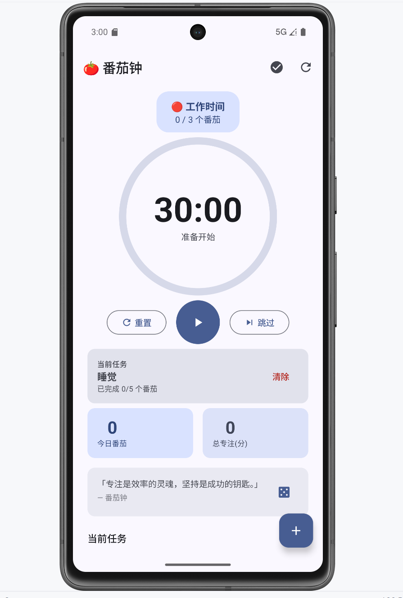
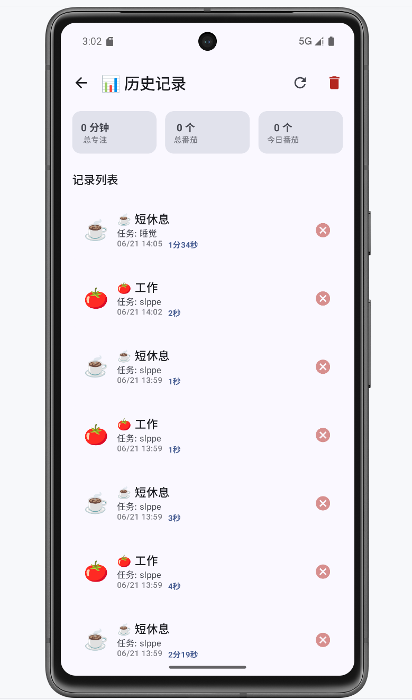
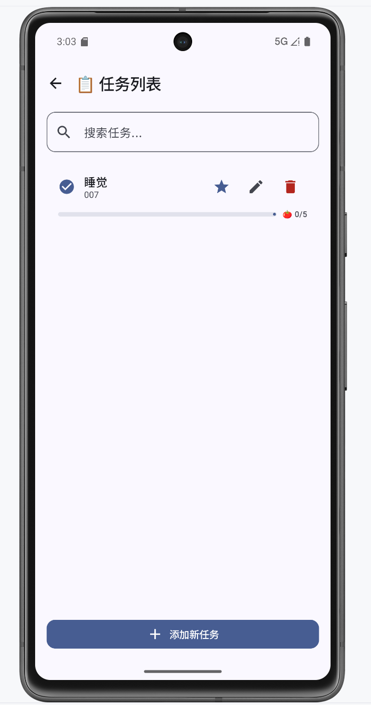
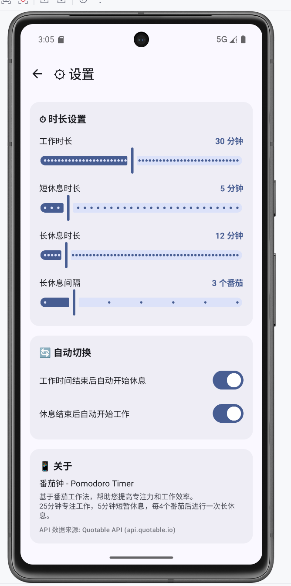

# 番茄钟 - Pomodoro Timer

GitHub 仓库地址：https://github.com/ltg-code/Pomodoro_Timer.git

---

## 1. 项目简介

- **应用名称**：番茄钟（Pomodoro Timer）
- **目标用户**：学生、上班族等需要提高专注力和时间管理效率的用户
- **核心功能**：
  - 🍅 番茄工作法计时：25 分钟工作 + 5/15 分钟休息循环
  - 📋 任务管理：创建、编辑、删除、搜索待办任务
  - 📊 历史记录：查看完成的番茄统计（总数、今日、总时长）
  - 💬 励志格言：从 Quotable API 在线获取格言激励
  - ⚙ 自定义设置：调整工作时长、休息时长、自动切换

---

## 2. 技术栈

- **UI**：Jetpack Compose + Material 3
- **数据库**：Room（2 张表）
- **网络**：Retrofit 2.9.0 + OkHttp 4.12.0（接口来源：Quotable API）
- **状态管理**：ViewModel + StateFlow
- **持久化偏好**：DataStore Preferences
- **导航**：Navigation Compose
- **异步处理**：Kotlin Coroutines
- **其他依赖**：Gson、Material Icons Extended、OkHttp Logging Interceptor

---

## 3. 功能清单

### 必做项完成情况

**UI 层**
- [x] Jetpack Compose 构建全部 UI（无 XML 布局文件）
- [x] 至少 2 个主要页面（共 4 个：计时、历史、任务、设置）
- [x] Compose Navigation 导航（4 条路由）
- [x] LazyColumn 列表（历史记录页、任务列表页）
- [x] Material 3 组件和主题（Card、Button、TextField、TopAppBar、FAB、Snackbar、Dialog、Slider、Switch 等）
- [x] 浅色 / 深色模式支持（自动跟随系统）

**数据层**
- [x] Room 数据库，至少 2 张表（pomodoro_sessions + tasks）
- [x] 完整 CRUD 操作（Insert/Update/Delete/Query）
- [x] DAO 查询方法返回 Flow 类型（getAllTasks()、getAllSessions()等）
- [x] 至少一种查询功能（模糊搜索 LIKE、统计查询 SUM/COUNT、今日筛选、按类型筛选）
- [x] DataStore 保存用户偏好（工作时长、休息时长、自动切换等 7 项）

**网络层**
- [x] 声明并使用 Internet 权限
- [x] 使用 Retrofit + OkHttp 从 Quotable API 获取励志格言
- [x] 网络数据在主页 QuoteCard 中展示
- [x] 处理 Loading / Success / Error 等网络状态
- [x] Composable 不直接发起网络请求（通过 ViewModel → Repository）

**架构层**
- [x] ViewModel 状态管理（TimerViewModel、HistoryViewModel、TaskViewModel）
- [x] Repository 模式（PomodoroRepository 隔离 DAO 和网络）
- [x] StateFlow / Flow 数据流
- [x] Kotlin 协程异步处理（viewModelScope.launch）
- [x] UiState 描述界面状态（sealed interface 用于 HistoryUiState / TaskListUiState）
- [x] Composable 不直接访问数据库或网络

**功能完整性**
- [x] 新增 / 编辑 / 删除 / 搜索等核心操作（实现 7 项交互功能）
- [x] 输入验证（任务名称必填校验、预估番茄数数字校验）
- [x] 错误提示（Snackbar 错误消息、空状态引导文案）
- [x] 状态展示（空/加载/错误三种状态全覆盖）
- [x] 屏幕旋转后状态保持（ViewModel 管理）

### 选做项完成情况

- [x] 复杂数据库查询：按类型/日期筛选、统计（SUM/COUNT）、今日数据筛选
- [x] 模糊搜索（LIKE 查询）：任务列表支持标题和描述的关键词搜索
- [x] 搜索防抖（300ms delay）：搜索框输入延迟 300ms 后触发查询
- [x] 动画效果：计时器圆形进度动画（animateFloatAsState）

---

## 4. 数据库设计

### 表 1：tasks（任务表）

| 字段名 | 类型 | 说明 |
|---|---|---|
| id | Long | 主键，自增 |
| title | String | 任务名称 |
| description | String | 任务描述（可选） |
| estimatedPomodoros | Int | 预估需要的番茄数 |
| completedPomodoros | Int | 已完成的番茄数 |
| isActive | Boolean | 是否激活（激活的任务显示在首页） |
| createdAt | Long | 创建时间戳 |
| updatedAt | Long | 更新时间戳 |

### 表 2：pomodoro_sessions（番茄记录表）

| 字段名 | 类型 | 说明 |
|---|---|---|
| id | Long | 主键，自增 |
| taskId | Long? | 关联任务 ID（可空） |
| startTime | Long | 开始时间戳 |
| endTime | Long | 结束时间戳 |
| durationSeconds | Int | 时长（秒） |
| type | String | 类型：work / short_break / long_break |
| isCompleted | Boolean | 是否完成 |
| note | String | 备注 |

**表关系**：pomodoro_sessions.taskId 关联 tasks.id，一个任务可有多个番茄记录。

**主要 DAO 查询**：
- `TaskDao.searchTasks(query)` — 按关键词模糊搜索（LIKE）
- `PomodoroSessionDao.getTotalCompletedWorkSessions()` — 统计总番茄数
- `PomodoroSessionDao.getTodayCompletedWorkSessions()` — 统计今日番茄数
- `PomodoroSessionDao.getTotalWorkSeconds()` — 统计总专注时长
- `PomodoroSessionDao.getSessionsByType(type)` — 按类型筛选记录
- `PomodoroSessionDao.getSessionsByTaskId(taskId)` — 按任务查询记录

---

## 5. 网络功能设计

- **API 来源**：Quotable API（https://api.quotable.io），免费开放 API，无需 API Key
- **接口地址**：`GET https://api.quotable.io/random?tags=motivational|productivity`
- **请求方式**：GET
- **主要返回字段**：
  - `_id`：格言 ID
  - `content`：格言正文
  - `author`：作者
  - `tags`：标签列表
  - `length`：字符长度
- **App 中使用这些网络数据的页面或功能**：主页 TimerScreen 的 QuoteCard 组件展示励志格言，用户可点击刷新按钮获取新格言
- **网络失败时的处理方式**：
  - 显示 Loading 加载动画
  - 网络异常时自动显示默认格言"专注是效率的灵魂，坚持是成功的钥匙。"
  - 可通过右侧骰子按钮手动重试

---

## 6. 架构设计

```
┌─────────────────────────────────┐
│ UI Layer (Composable)           │
│ TimerScreen / HistoryScreen     │
│ TaskListScreen / SettingsScreen │
│   ↓ collectAsState()            │
├─────────────────────────────────┤
│ ViewModel Layer                 │
│ TimerViewModel / HistoryVM      │
│ TaskViewModel                   │
│ StateFlow<T> exposed to UI      │
│   ↓                             │
├─────────────────────────────────┤
│ Repository Layer                │
│ PomodoroRepository              │
│   ↓           ↓                 │
├──────────────────┬──────────────┤
│ Room DB          │ Network      │
│ PomodoroSession  │ ApiService   │
│ TaskDao          │ NetworkData  │
│   ↓              │ Source       │
│ RoomDatabase     │ Retrofit     │
└──────────────────┴──────────────┘
│                                 │
│ DataStore (UserPreferences)     │
└─────────────────────────────────┘
```

- **UI Layer**：Composable 函数只负责界面渲染和用户事件分发，通过 `collectAsState()` 观察 ViewModel 的状态
- **ViewModel Layer**：使用 `MutableStateFlow` + `StateFlow` 管理 UiState，在 `viewModelScope` 中通过 Repository 访问数据
- **Repository Layer**：封装了两类数据源：Room DAO（本地持久化）和 NetworkDataSource（远程 API），对上层屏蔽数据来源差异
- **DataStore**：独立于 Repository，由 ViewModel 直接使用，用于保存用户偏好设置

---

## 7. 核心功能截图

> 请在此处替换为实际截图

### 主页（计时器）

说明：番茄钟主界面，显示倒计时圆环、工作/休息状态、控制按钮（开始/暂停/重置/跳过）、当前任务、今日统计和励志格言。

### 历史记录

说明：展示所有完成的番茄记录列表，顶部统计总专注时长、总番茄数和今日番茄数。

### 任务列表

说明：任务管理页面，支持搜索、新增、编辑、删除任务，显示每个任务的番茄完成进度。

### 设置

说明：自定义工作时长（5-60分钟）、休息时长、长休息间隔、自动切换开关。

---

## 8. 技术难点与解决方案

### 难点 1：Gradle 构建配置兼容性问题

- **问题描述**：项目初始使用 AGP 9.1.0 + Kotlin 2.2.10，添加 Room 依赖时需要 KSP 注解处理器，但 KSP 版本与 Kotlin 2.2.10 不兼容，导致构建失败。后尝试降级到 Kotlin 1.9.25 + kapt，又遇到 Gradle 9.3.1 与 kapt 不兼容的 API 变更问题。
- **原因分析**：Kotlin 2.2.10 太新，对应的 KSP 版本尚未在 Maven Central 稳定发布；Gradle 9.x 修改了 `Configuration.fileCollection(Spec)` API，kapt 插件依赖该 API。
- **解决方案**：
  1. 降级 Gradle Wrapper 至 8.11.1（兼容 kapt）
  2. 使用 AGP 8.7.0 + Kotlin 1.9.25 + kapt 1.9.25 稳定组合
  3. 配置 `org.gradle.java.home` 指向正确的 JDK 21（修复 jlink 路径问题）
  4. 添加 `android.useAndroidX=true` 和 `android.nonTransitiveRClass=true`
- **参考资料**：Gradle 官方文档兼容性矩阵、Stack Overflow

### 难点 2：模拟器 HTTPS 证书验证失败

- **问题描述**：Android 模拟器上访问 Quotable API 时出现 "Chain validation failed" SSL 证书验证错误，导致网络格言无法加载。
- **原因分析**：Android 模拟器的 CA 证书存储可能与某些 HTTPS 站点的证书链不兼容，这是模拟器环境的常见问题，真机上通常不存在该问题。
- **解决方案**：
  1. 为 OkHttp 配置自定义 TrustManager，在开发环境中信任所有 SSL 证书
  2. 添加兜底机制：网络请求失败时自动显示默认格言
  3. 用户可通过骰子按钮手动重试网络请求

### 难点 3：Kotlin 协程上下文管理

- **问题描述**：SettingsScreen 中 Slider 和 Switch 的 `onValueChange` 回调在 Composable 上下文中执行，但 DataStore 的保存方法是 `suspend` 函数，直接调用会编译报错。
- **原因分析**：Composable 函数不是协程作用域，无法直接调用挂起函数。
- **解决方案**：使用 `rememberCoroutineScope()` 获取与 Composable 生命周期绑定的协程作用域，通过 `scope.launch { }` 包装 suspend 调用。

---

## 9. AI 使用说明

请在以下选项中勾选，可多选：

- [x] AI Agent / 编程代理（如 Claude Code、Codex、OpenCode、Cursor Agent 等）
- [x] 国产大模型服务（如 DeepSeek、GLM、通义千问、文心一言等）

**具体工具名称**：CodeBuddy（IDE 内置 AI Agent）

**AI 主要用于哪些环节**：
- 项目结构设计和代码生成（Entity、DAO、ViewModel、Screen 等全部代码）
- Gradle 构建配置修复（版本兼容性问题排查）
- Bug 调试和编译错误修复
- 需求核对和报告撰写

**说明**：是否使用 AI 以及使用了什么 AI 工具不会影响分值，请如实填写。本项目全程使用 CodeBuddy AI Agent 辅助开发。

---

## 10. 运行说明

- **最低 Android 版本**：API 24（Android 7.0）
- **目标/编译 SDK 版本**：API 35（Android 14）
- **特殊权限**：`android.permission.INTERNET`（网络权限，用于获取在线格言）
- **运行步骤**：
  1. 克隆仓库：`git clone https://github.com/你的用户名/仓库名`
  2. 使用 Android Studio（推荐 Ladybug 或更新版本）打开项目
  3. 等待 Gradle 同步完成（首次可能需要下载 Gradle 8.11.1）
  4. 连接模拟器或真机，点击 Run ▶

---

## 11. 项目亮点

- **完整的架构分层**：严格遵循 MVVM + Repository 模式，UI、ViewModel、数据层职责分明
- **丰富的状态管理**：使用 sealed interface 定义 UiState，覆盖 Loading/Success/Empty/Error 四种状态
- **流畅的用户体验**：圆形进度动画、搜索防抖、Snackbar 提示、空状态引导
- **数据统计**：支持今日/总计番茄数和专注时长统计
- **深色模式**：自定义番茄红主题色，自动跟随系统深浅色切换

---

## 12. 未来改进方向

- 添加 Notification 通知提醒（番茄完成时推送通知）
- 添加音效或震动反馈
- 支持数据导出（JSON/CSV）
- 添加图表统计（周/月番茄趋势图）
- 使用 Hilt 实现依赖注入
- 为 ViewModel 和 Repository 编写单元测试
