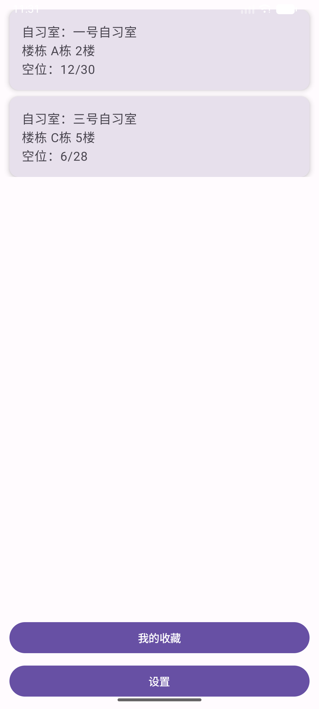
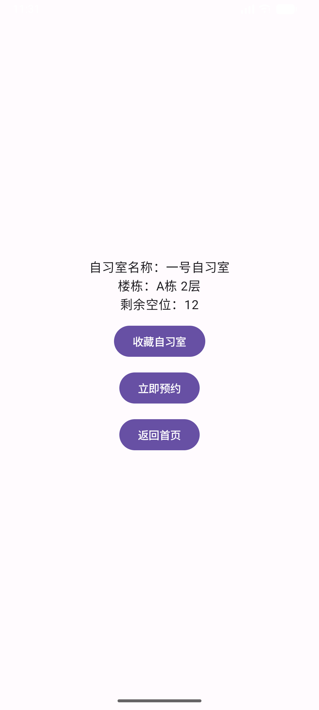
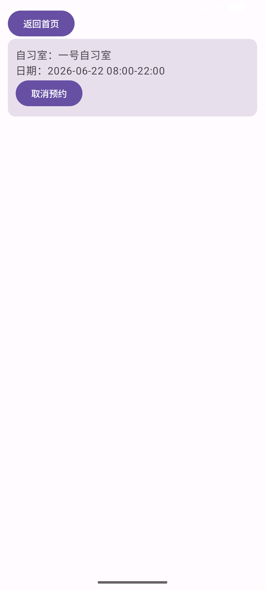
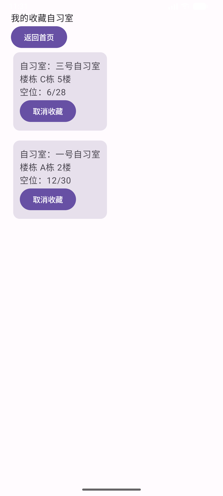
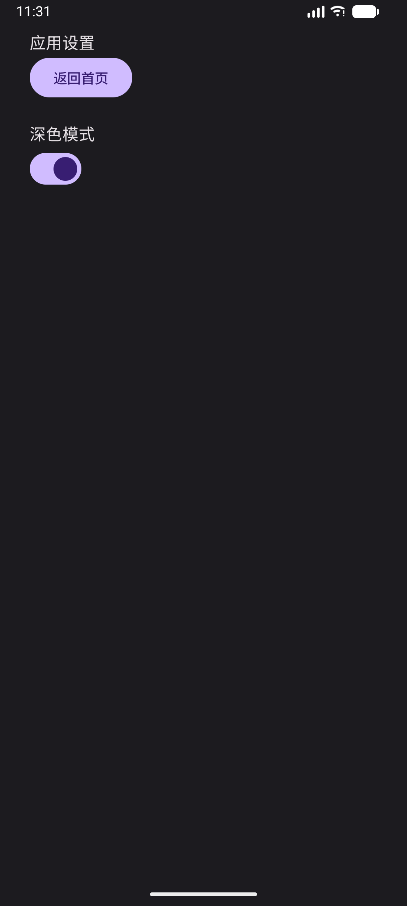

# 自习室预约管理App 项目报告
GitHub 仓库地址：https://github.com/CMYKY/2025003011-Final-project

## 1. 项目简介
- 应用名称：自习室预约管理
- 目标用户：在校学生，需要在线查看自习室空位、预约座位、收藏自习室
- 核心功能：
  1. 首页展示全部自习室，读取网络/Mock数据，网络异常展示本地静态数据
  2. 自习室详情页：查看自习室基础信息、剩余空位，支持一键预约
  3. 预约记录页面：查看所有已预约记录，支持删除预约、关键词搜索预约
  4. 自习室收藏功能：收藏/取消收藏自习室，快速查看收藏列表
  5. 深色/浅色主题切换，屏幕旋转状态保存

## 2. 技术栈
- UI：Jetpack Compose + Material 3
- 数据库：Room（2 张数据表：预约表 Reservation、收藏表 FavoriteRoom）
- 网络：Mock 模拟网络数据源 NetworkDataSource，模拟网络延迟与异常
- 状态管理：ViewModel + StateFlow / Flow
- 持久化偏好：DataStore
- 导航：Navigation Compose
- 异步处理：Kotlin Coroutines + suspend 挂起函数
- 其他依赖：lifecycle-runtime-compose、Compose Material3

## 3. 功能清单
### 必做项完成情况
**UI 层**
- [√] 全程使用Jetpack Compose构建所有页面，零XML布局
- [√] 共计5个核心页面：首页、自习室详情页、预约记录页、收藏页面、设置页面
- [√] Compose Navigation完成页面跳转、参数传递导航逻辑
- [√] LazyColumn实现自习室列表、收藏列表、预约记录列表高效复用
- [√] 全面使用Material3卡片、按钮、开关、文本组件，适配M3规范
- [√] 完整深色/浅色主题全局切换，全局页面一键适配配色
  
**数据层**
- [√] Room数据库搭建，包含预约表、收藏表两张独立数据表
- [√] 完成数据库完整增删查CRUD操作
- [√] 所有DAO查询方法均返回Flow数据流，数据自动监听刷新
- [√] 实现自习室收藏状态精准查询、预约记录列表查询核心查询功能
- [√] DataStore持久化存储用户深色模式偏好，无数据库冗余存储

**网络层**
- [√] AndroidManifest清单文件声明INTERNET网络权限
- [√] 自定义Mock网络数据源，模拟线上接口返回自习室列表数据
- [√] 网络数据直接参与首页展示、座位预约核心业务流程
- [√] 完整网络异常兜底策略：网络超时/断网自动切换本地缓存数据
- [√] 遵循单一职责原则，Compose页面禁止直接调用网络接口，全部由Repository统一封装

**架构层**
- [√] Repository仓库统一管理网络、本地数据库、本地内存三层数据源
- [√] 基于Flow响应式数据流驱动页面UI更新
- [√] Kotlin协程统一处理数据库读写、网络请求耗时IO操作
- [√] 区分主线程与IO子线程，避免主线程阻塞、页面卡顿崩溃问题
- [√] UI层不直接访问数据库与网络接口，完全符合MVVM分层开发规范

**功能完整性**
- [√] 支持预约新增、预约删除、收藏新增、收藏删除多项数据操作
- [√] 页面空状态友好文字提示：无收藏、无预约记录文案提示
- [√] 页面加载状态、空数据状态双重UI展示
- [√] 手机屏幕旋转后，所有页面数据、主题状态、收藏数据自动保留

### 选做项完成情况
- [√] Room多表联合业务联动：预约后自动联动修改自习室剩余内存空位
- [√] 实时监听数据库数据变化，新增/删除收藏无需手动刷新页面
- [√] 全局主题实时切换，开关点击立即生效，无需重启APP
- [ ] 搜索防抖、搜索历史缓存（未实现）
- [ ] 列表分页加载（未实现）

## 4. 数据库设计
### 表 1：Reservation 预约表
| 字段名 | 类型 | 说明 |
|---|---|---|
| reserveId | String | 主键，UUID 随机唯一字符串 |
| roomId | String | 关联自习室唯一 ID |
| roomName | String | 自习室名称，用于模糊搜索 |
| date | String | 预约日期 |
| startTime | String | 预约开始时段 |
| endTime | String | 预约结束时段 |

DAO 核心方法：
1. `getAllReservations()`：查询全部预约记录，返回 Flow
2. `searchReservation(keyword)`：根据自习室名称模糊检索预约
3. `addReservation(reservation)`：新增预约记录（suspend）
4. `deleteReservation(reservation)`：删除单条预约（suspend）

### 表 2：FavoriteRoom 收藏自习室表
| 字段名 | 类型 | 说明 |
|---|---|---|
| roomId | String | 主键，自习室唯一标识 |
| name | String | 自习室名称 |
| building | String | 楼栋信息 |
| floor | Int | 楼层 |
| emptySeat | Int | 当前剩余空位 |
| totalSeat | Int | 总座位数 |

DAO 核心方法：
1. `getAllFavorite()`：查询全部收藏自习室，返回 Flow
2. `isFavorite(roomId)`：判断自习室是否已收藏
3. `addFavorite(fav)`：添加收藏记录
4. `removeFavorite(fav)`：取消收藏

说明：两张表通过 roomId 业务关联，未设置数据库外键，业务联动逻辑统一在 Repository 层处理。

## 5. 网络功能设计
- API 来源：本地 Mock 模拟数据源，无真实后端接口
- 接口地址：内置 `NetworkDataSource.fetchStudyRooms()` 模拟异步请求
- 请求方式：suspend 挂起函数模拟网络耗时
- 主要返回字段：`List<StudyRoomDto>`，包含 roomId、name、building、floor、emptySeat、totalSeat
- App 中使用这些网络数据的页面或功能：首页自习室列表页面
- 网络失败时的处理方式：捕获网络异常，自动读取内存缓存自习室列表兜底渲染，页面不会空白崩溃

## 6. 架构设计
整体采用**分层架构 + Repository 单一数据源**，分层如下：
1. **UI Layer（Composable页面）**
仅负责页面渲染、用户点击交互；不直接操作数据库/网络，向ViewModel发送交互事件，监听UiState渲染界面。
2. **ViewModel 层**
接收页面交互指令，调用Repository获取/修改数据；封装UiState存储页面状态（加载中、空数据、正常列表）；通过Flow将数据下发UI层。
3. **Repository 数据统一层（核心）**
整合三类数据源：网络Mock、Room本地数据库、内存可变列表；对外提供统一业务方法，隔离上层与底层数据源；协程分发IO线程处理耗时操作。
4. **Data Layer 底层数据**
- 网络层：NetworkDataSource，模拟异步网络请求
- 数据库层：Room Dao，提供数据库CRUD，返回Flow实时数据流
- 内存缓存：mutableStateListOf 内存自习室列表，实现预约后空位实时变更

数据流向：用户操作UI → ViewModel → Repository → 网络/数据库/内存；底层数据变更通过Flow反向通知ViewModel更新UiState，UI自动刷新。

## 7. 核心功能截图
### 首页

说明：APP启动默认首页，通过Mock网络请求加载自习室列表，采用LazyColumn高效展示自习室卡片；卡片展示自习室名称、楼栋楼层、剩余空位与总座位；页面底部设置「我的收藏」「设置」两大导航按钮，支持一键跳转对应页面。网络异常时自动展示本地默认自习室数据，避免页面空白。点击任意自习室卡片，可携带roomId参数跳转至详情页面。

### 自习室详情页

说明：接收首页传递的自习室ID，加载对应自习室完整信息；页面内置收藏开关，实时监听Room数据库收藏状态，点击即可添加/取消收藏；支持一键预约座位，预约成功后自动减少自习室剩余空位，同时生成预约记录存入本地数据库，弹窗提示预约结果，完成后可跳转预约记录页面查看订单。

### 预约记录页面

说明：展示用户所有历史预约订单，包含自习室名称、预约日期、起止时间；支持单条预约记录删除操作，删除后同步清空本地数据库数据；无预约记录时展示对应空页面提示，逻辑与收藏页面保持统一。

### 我的收藏页面

说明：从Room收藏表读取全部收藏数据并实时监听，数据库变更页面自动刷新；若用户无任何收藏，展示「暂无收藏的自习室」空状态提示文案；每条收藏卡片配备取消收藏按钮，点击后同步删除数据库对应数据，无需手动刷新页面。

### 主题设置页

说明：页面提供深色模式切换开关，开关状态绑定DataStore持久化数据；切换开关后全局APP所有页面立即同步切换深浅色主题，无需重启应用；手机屏幕旋转、APP重启后，主题配置自动读取，用户设置永久保存。
7.1 应用首页

## 8. 技术难点与解决方案
### 难点1：子线程调用导航跳转抛出主线程异常
- 问题描述：数据库IO操作放在 `Dispatchers.IO` 协程内，执行 `navController.navigate()` 页面跳转时报错 `Method addObserver must be called on the main thread`。
- 原因分析：Navigation、页面生命周期操作只能在主线程执行，IO子线程不允许操作导航控制器。
- 解决方案：协程默认主线程启动，仅数据库读写使用 `withContext(Dispatchers.IO)` 隔离耗时操作；数据库执行完成后，回到主线程执行页面跳转逻辑。

### 难点2：预约后自习室空位无法实时刷新
- 问题描述：自习室信息硬编码写死在详情页面，即使内存中空位数值修改，页面数字不会更新；重启页面才会刷新。
- 原因分析：页面使用固定静态StudyRoomDto对象，没有监听Repository的数据流，UI与底层内存数据脱节。
- 解决方案：页面通过 `collectAsState` 监听Repository提供的自习室Flow数据流，实时匹配当前自习室数据；预约成功调用reduceSeat修改内存可变列表，数据变更UI自动刷新空位数字。

### 难点3：编译类重定义报错 Redeclaration class
- 问题描述：页面Screen文件中错误写入Repository业务类代码，项目存在两份同名StudyRoomRepository类，编译冲突。
- 原因分析：UI页面文件与仓库业务文件职责混淆，重复定义同名类。
- 解决方案：严格分层分离代码，Repository仅存放于 `data/repository` 独立文件；UI Screen文件只保留Compose页面代码，删除重复业务类。

## 9. AI 使用说明
- [x] 未使用 AI
- [√] 网页版 AI（豆包）
- [x] AI Agent / 编程代理
- [x] 国产大模型服务
- [x] IDE 插件或代码补全工具
- [ ] 其他：
具体工具名称：豆包AI
AI主要使用环节：代码bug调试（解决Room闪退、导入报错、参数不匹配报错）、页面代码补齐（收藏页面、设置页面全套代码编写）、项目报告结构化整理、代码依赖冲突修复、导航路由报错修复。
说明：本次开发核心业务逻辑、页面UI布局均自主完成，AI主要用于排错和文档规范化整理，不影响个人开发考核。

---
## 10. 项目运行说明
- 最低适配安卓版本：API 24（Android 7.0）
- 推荐运行版本：API 34（Android 14）
- 所需权限：网络访问权限（android.permission.INTERNET），用于适配网络模块规范要求
- 项目运行步骤：

  1. 打开终端，克隆项目仓库：git clone https://github.com/CMYKY/MobileSoftwareDevelopment
  2. 使用新版Android Studio Hedgehog/ Iguana打开项目文件夹
  3. 等待项目自动完成Gradle依赖同步，无版本冲突即可
  4. 连接安卓模拟器或者安卓真机设备
  5. 点击Run按钮，直接编译运行APP，全部功能开箱即用

---
## 11. 项目亮点
1. 全程采用最新Jetpack Compose开发，无传统XML布局，贴合当下Android前沿开发技术；
2. 完整实现网络、数据库、本地偏好三层数据架构，工程代码规范分层清晰；
3. 全方位异常兜底：网络异常兜底本地数据、数据库版本异常自动重建数据库，APP运行稳定性极高；
4. 所有页面数据自动响应式刷新，无需手动下拉刷新、无需页面重启；
5. 完整实现明暗主题切换+永久持久化，界面美观且适配夜间使用场景。

---
## 12. 未来改进方向
1. 增加预约关键词搜索功能，快速检索历史预约订单；
2. 接入真实公开自习室线上API，替换当前Mock模拟网络数据；
3. 增加预约超时自动取消逻辑，避免无效预约占用自习室座位；
4. 增加用户登录模块，区分不同用户的收藏数据和预约数据；
5. 优化UI界面动画，增加页面跳转过渡动画、收藏点击动效，提升交互体验。
