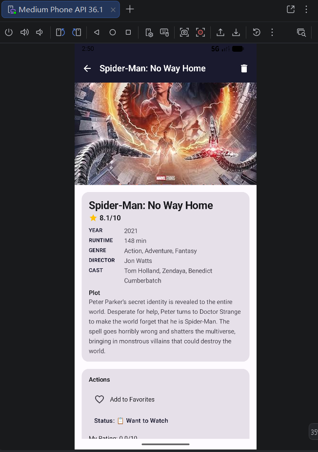

# MovieVault - 电影收藏管理

GitHub 仓库地址：https://github.com/TI-cia-886/2025003032_MovieVault

## 1. 项目简介

- **应用名称**：MovieVault（电影收藏管理）
- **目标用户**：电影爱好者，希望系统化管理自己看过的、想看的和正在看的电影的用户
- **核心功能**：在线搜索电影并添加到本地收藏、管理观看状态（想看/正在看/已看）、撰写影评与评分、收藏切换、列表/网格视图切换、多维度排序与筛选、深浅色主题切换

## 2. 技术栈

- UI：Jetpack Compose + Material 3
- 数据库：Room（2 张表：movies、reviews）
- 网络：Retrofit + OkHttp（接口来源：OMDb API https://www.omdbapi.com/）
- 状态管理：ViewModel + StateFlow
- 持久化偏好：DataStore Preferences
- 导航：Navigation Compose
- 异步处理：Kotlin Coroutines
- 图片加载：Coil Compose
- JSON 解析：Gson
- DI：手动依赖注入（AppContainer）

## 3. 功能清单

**UI 层**
- [x] Jetpack Compose 构建全部 UI
- [x] 至少 2 个主要页面（4 个页面：Splash、MovieList、MovieDetail、AddMovie）
- [x] Compose Navigation 导航（NavHost + composable 路由）
- [x] LazyColumn / LazyVerticalGrid 列表（列表视图/网格视图切换）
- [x] Material 3 组件和主题（TopAppBar、Card、FilterChip、FloatingActionButton、Slider、Dialog 等）
- [x] 浅色 / 深色模式支持（System / Light / Dark 三态切换）

**数据层**
- [x] Room 数据库，至少 2 张表（movies + reviews，外键关联）
- [x] 完整 CRUD 操作（新增、查看、更新、删除）
- [x] DAO 查询方法返回 Flow 类型（getAllMovies、getReviewsForMovie 等）
- [x] 至少一种查询功能（搜索 title/director/actors、按观看状态筛选、按类型筛选、收藏筛选）
- [x] DataStore 保存用户偏好或最近状态（主题模式、默认分类、搜索历史、视图模式、排序偏好）

**网络层**
- [x] 声明并使用 Internet 权限
- [x] 使用网络请求获取真实 API 或 Mock API 数据（OMDb API + 内置 12 部电影 Mock 数据）
- [x] 网络数据在核心页面中展示或参与主要功能流程（AddMovieScreen 在线搜索并添加到收藏）
- [x] 处理 Loading / Success / Error 等网络状态（sealed interface UiState）
- [x] Composable 不直接发起网络请求（通过 ViewModel → Repository → NetworkDataSource）

**架构层**
- [x] ViewModel 状态管理
- [x] Repository 模式
- [x] StateFlow / Flow 数据流
- [x] Kotlin 协程异步处理
- [x] UiState 描述界面状态（sealed interface：Loading / Success / Error / Idle / SearchResults 等）
- [x] Composable 不直接访问数据库或网络

**功能完整性**
- [x] 新增 / 编辑 / 删除 / 搜索等核心操作（新增电影、删除电影、搜索电影、编辑观看状态、编辑评分、新增/删除影评）
- [x] 输入验证和错误提示（Snackbar 错误提示、重复电影检测）
- [x] 状态展示（空状态 EmptyState、加载状态 LoadingState、错误状态 ErrorState）
- [x] 屏幕旋转后状态保持（ViewModel + StateFlow）

### 完成情况

- [x] Coil 图片加载（AsyncImage 加载电影海报）
- [x] 复杂数据库查询（AVG 聚合查询平均评分、COUNT 统计、LIKE 模糊搜索、外键级联删除）
- [x] 搜索防抖（列表搜索 300ms、在线搜索 500ms）
- [x] 搜索历史（DataStore 保存上次搜索关键词）
- [x] 自定义动画（Splash 旋转胶卷、闪烁星星、空状态浮动图标、加载脉冲动画）
- [x] 收藏功能（isFavorite 切换，FilterChip 快速筛选收藏）
- [x] 影评系统（评分 + 文字评论，平均分统计）
- [x] 网格/列表视图切换并持久化偏好
- [x] Mock 数据支持（12 部经典电影完整数据，可切换真实 API / Mock）

## 4. 数据库设计

### 表 1：movies（电影表）

| 字段名 | 类型 | 说明 |
|---|---|---|
| id | INTEGER (PK) | 主键，自增 |
| title | TEXT | 电影标题 |
| year | TEXT | 上映年份 |
| poster_url | TEXT | 海报 URL |
| plot | TEXT | 剧情简介 |
| director | TEXT | 导演 |
| actors | TEXT | 演员 |
| genre | TEXT | 类型（如 "Drama, Crime"） |
| imdb_rating | TEXT | IMDb 评分 |
| runtime | TEXT | 片长 |
| imdb_id | TEXT | IMDb ID（用于去重） |
| is_favorite | INTEGER | 是否收藏 (0/1) |
| watch_status | TEXT | 观看状态（want_to_watch / watching / watched） |
| user_rating | REAL | 用户评分 (0.0–5.0) |
| created_at | INTEGER | 创建时间戳 |
| updated_at | INTEGER | 更新时间戳 |

### 表 2：reviews（影评表）

| 字段名 | 类型 | 说明 |
|---|---|---|
| id | INTEGER (PK) | 主键，自增 |
| movie_id | INTEGER (FK) | 关联电影 ID（外键，级联删除） |
| content | TEXT | 影评内容 |
| rating | REAL | 影评评分 (0.0–5.0) |
| created_at | INTEGER | 创建时间戳 |
| updated_at | INTEGER | 更新时间戳 |

**表关系**：reviews.movie_id → movies.id，设置 `onDelete = CASCADE`，删除电影时自动删除关联影评。

**主要 DAO 查询方法**：
- `getAllMovies()`：返回 `Flow<List<MovieEntity>>`，按创建时间倒序
- `searchMovies(query)`：LIKE 模糊搜索 title / director / actors
- `getMoviesByWatchStatus(status)`：按观看状态筛选
- `getFavoriteMovies()`：筛选收藏电影
- `getMoviesByGenre(genre)`：按类型筛选
- `getReviewsForMovie(movieId)`：返回某电影的所有影评 Flow
- `getAverageRatingForMovie(movieId)`：AVG 聚合查询平均评分
- `getReviewCountForMovie(movieId)`：COUNT 统计影评数

## 5. 网络功能设计

- **API 来源**：OMDb API（The Open Movie Database）
- **接口地址**：`https://www.omdbapi.com/`
- **请求方式**：GET
- **主要返回字段**：
  - 搜索接口 `?s={query}`：Title、Year、imdbID、Type、Poster
  - 详情接口 `?i={imdbID}`：Title、Year、Plot、Director、Actors、Genre、imdbRating、Runtime、Poster 等
- **App 中使用这些网络数据的页面或功能**：
  - AddMovieScreen：用户输入关键词 → 调用搜索接口 → 展示搜索结果列表 → 点击 + 按钮 → 调用详情接口 → 存入 Room 数据库
- **网络失败时的处理方式**：
  - Repository 层使用 `Result<T>` 封装成功/失败
  - ViewModel 将失败映射为 UiState.Error
  - UI 层展示 ErrorState 组件 + Snackbar 错误提示
  - 内置 12 部电影 Mock 数据，API 不可用时仍可演示完整功能

## 6. 架构设计

本项目采用 **MVVM + Repository** 架构模式，分层如下：

```
┌──────────────────────────────────────────────────────────┐
│  UI Layer (Compose)                                       │
│  ┌──────────┐ ┌──────────┐ ┌──────────┐ ┌──────────┐    │
│  │  Splash   │ │MovieList │ │MovieDetail│ │ AddMovie │    │
│  │  Screen   │ │  Screen  │ │  Screen   │ │  Screen  │    │
│  └──────────┘ └────┬─────┘ └────┬─────┘ └────┬─────┘    │
│                    │colletAsState│            │            │
├────────────────────┼─────────────┼────────────┼──────────┤
│  ViewModel Layer   │             │            │            │
│  ┌─────────────────┴──┐ ┌───────┴──────┐ ┌──┴──────────┐ │
│  │MovieListViewModel │ │MovieDetailVM │ │AddMovieVM   │ │
│  │ StateFlow<UiState>│ │StateFlow<...>│ │StateFlow<...>│ │
│  └────────┬──────────┘ └──────┬───────┘ └─────┬────────┘ │
├───────────┼────────────────────┼───────────────┼──────────┤
│Repository │                    │               │           │
│  ┌────────┴────────────────────┴───────────────┴────────┐ │
│  │              MovieRepository                          │ │
│  │  统一封装本地（Room DAO）和网络（NetworkDataSource）    │ │
│  └──┬──────────────────────────────┬────────────────────┘ │
├─────┼──────────────────────────────┼──────────────────────┤
│Data │                              │                       │
│  ┌──┴──────────┐  ┌──────────┐  ┌─┴─────────────────┐    │
│  │   Room DB    │  │DataStore │  │ NetworkDataSource │    │
│  │ MovieDao     │  │Preferences│  │  Retrofit+OkHttp │    │
│  │ ReviewDao    │  │          │  │  OMDb API         │    │
│  └─────────────┘  └──────────┘  └───────────────────┘    │
└──────────────────────────────────────────────────────────┘
```

**数据流说明**：

1. **UI Layer**：Composable 通过 `collectAsState()` 观察 ViewModel 的 `StateFlow<UiState>`
2. **ViewModel Layer**：使用 `combine` + `flatMapLatest` 构建响应式数据管道，筛选/搜索/排序任一条件变化自动重新查询
3. **Repository Layer**：封装本地数据库和网络数据源的访问，对 ViewModel 暴露统一的 Flow 和 suspend 函数
4. **Data Layer**：Room 提供本地持久化（Flow 实时更新），Retrofit 提供网络请求，DataStore 保存用户偏好

**UiState 设计**：所有 UiState 使用 `sealed interface`，包含：
- `MovieListUiState`：Loading / Success / Error
- `MovieDetailUiState`：Loading / Success / Error
- `AddMovieUiState`：Idle / Loading / SearchResults / DetailLoading / MovieAdded / Error

**关键设计决策**：
- MovieListViewModel 使用 `combine(_selectedFilter, _searchQuery, _sortOrder)` + `flatMapLatest { repository.getAllMovies() }`，确保筛选/搜索/排序联动，且 Room Flow 自动推送数据变更
- 电影计数（total、watched、wantToWatch、watching）从 `getAllMovies()` 实时计算，而非缓存，保证 FilterChip 数字始终准确
- 搜索防抖：列表搜索 300ms，在线搜索 500ms，避免频繁请求
- 视图切换即时更新 UI 状态（直接 copy 当前 UiState），同时异步持久化到 DataStore

## 7. 核心功能截图

### 首页 - 电影列表

说明：展示电影收藏列表，支持网格/列表视图切换。顶部 TopAppBar 包含添加电影、主题切换、搜索、排序和视图切换按钮。下方 FilterChip 栏显示 All / Want to Watch / Watching / Favorites 筛选，数字实时更新。

### 搜索添加页

说明：点击加号进入在线搜索页面，输入电影名称即可通过 OMDb API 搜索全球电影数据库。搜索结果以卡片列表展示，包含海报缩略图、标题、年份和类型，点击 + 按钮即可添加到本地收藏。

### 电影详情页

说明：展示电影完整信息（海报、标题、年份、IMDb 评分、时长、类型、导演、演员、剧情）。支持收藏切换、观看状态下拉选择、用户评分 Slider。底部影评区支持添加和删除影评。

### 深色模式

说明：支持 System / Light / Dark 三态主题切换，所有页面完美适配深色主题。

## 8. 技术难点与解决方案

### 难点 1：筛选/搜索/排序的响应式联动与列表不更新问题

- **问题描述**：添加/删除电影后，列表不自动刷新；排序后 FilterChip 数字计数不更新。
- **原因分析**：最初使用 `_refreshTrigger` 手动触发刷新，但 combine 中同时依赖 refreshTrigger 和筛选条件导致多次触发和 flatMapLatest 重新订阅，造成竞态条件。FilterChip 计数使用缓存变量，只在 init 和 onRefresh 时更新。
- **解决方案**：
  1. 从 combine 中移除 `_refreshTrigger`，完全依赖 Room Flow 自动推送数据变更
  2. 改为始终观察 `repository.getAllMovies()`，在内存中执行筛选/排序
  3. 电影计数从 `allMovies` 实时计算，而非缓存
- **参考资料**：Room Flow 官方文档、Kotlin Flow combine/flatMapLatest

### 难点 2：排序后不跳转到列表头部

- **问题描述**：用户切换排序方式后，列表停留在原位置，不会自动滚动到顶部。
- **原因分析**：最初使用 `LaunchedEffect(sortChangeTrigger)` 配合时间戳触发，但 `snapshotFlow` 在数据更新前就检测到旧数据的 `totalItemsCount > 0`，导致滚动在数据刷新前执行。
- **解决方案**：将 LaunchedEffect 的 key 改为直接监听 `currentSort`，在 LaunchedEffect 内部用 `snapshotFlow { gridState.layoutInfo.totalItemsCount > 0 }.first { it }` 等待新数据布局完成后再滚动。
- **参考资料**：Compose LazyGridState 文档、snapshotFlow

### 难点 3：主题切换需要点击两次

- **问题描述**：点击主题切换按钮需要点两次才能生效。
- **原因分析**：`onToggleTheme` 回调在 `scope.launch` 闭包中捕获了 Compose 重组时的 `themeMode` 值，该值是闭包创建时的过期值，而非 DataStore 最新值。
- **解决方案**：在闭包内通过 `appContainer.movieRepository.themeMode.first()` 直接从 DataStore 读取最新值，再计算下一个主题模式。
- **参考资料**：Kotlin Flow first()、Compose recomposition 与闭包捕获

### 难点 4：AnimatedVisibility 在 TextField trailingIcon 中编译错误

- **问题描述**：在 `TextField` 的 `trailingIcon` lambda 中使用 `AnimatedVisibility` 导致编译错误："cannot be called in this context with an implicit receiver"。
- **原因分析**：`AnimatedVisibility` 是 `ColumnScope` 的扩展函数，而 `trailingIcon` 的参数 lambda 不在 `ColumnScope` 上下文中。
- **解决方案**：改用简单的 `if` 条件判断替代 `AnimatedVisibility`，实现相同的条件显示效果。

## 9. AI 使用说明

请在以下选项中勾选，可多选：

- [x] 网页版 AI（如 ChatGPT、Claude、Kimi、豆包等）
- [x] AI Agent / 编程代理（如 Claude Code、Codex、OpenCode、Cursor Agent 等）
- [ ] 国产大模型服务（如 DeepSeek、GLM、通义千问、文心一言等）
- [ ] IDE 插件或代码补全工具（如 GitHub Copilot、Cursor、CodeGeeX 等）
- [ ] 其他：

具体工具名称：Claude Code（CodeBuddy）

AI 主要用于哪些环节：
- 代码生成：UI 页面构建、ViewModel 逻辑编写、数据库设计
- 调试：编译错误分析、数据流问题排查（列表不刷新、计数不更新、主题切换 Bug）
- 功能迭代：UI 重构（FilterChip 位置调整、搜索页面重新设计）
- 报告整理：README 文档和项目报告撰写
- 架构优化：combine/flatMapLatest 数据管道设计

说明：是否使用 AI 以及使用了什么 AI 工具不会影响分值，请如实填写。

## 10. 运行说明

- 最低 Android 版本：API 26（Android 8.0）
- 推荐 Android 版本：API 35（Android 15）
- 特殊权限：`android.permission.INTERNET`（网络访问）
- 运行步骤：
  1. 克隆仓库：`git clone https://github.com/你的用户名/MovieVault`
  2. 使用 Android Studio（2026.1.1+）打开项目
  3. 等待 Gradle 同步完成
  4. 可选：配置 OMDb API Key（`ApiService.kt` 中修改 `API_KEY`）
  5. 连接模拟器或真机，点击 Run

## 11. 项目亮点

1. **响应式数据管道**：使用 `combine` + `flatMapLatest` 构建筛选/搜索/排序联动管道，任一条件变化自动重新计算，且 Room Flow 自动推送数据变更，无需手动刷新
2. **完整的 UiState 设计**：每个页面对应独立的 sealed interface UiState，覆盖 Idle/Loading/Success/Error/SearchResults/MovieAdded/DetailLoading 等多种状态
3. **动画细节**：Splash 页 Canvas 旋转胶卷 + 闪烁星星动画、空状态浮动图标、加载脉冲动画，提升用户体验
4. **双模式搜索**：MovieListScreen 本地搜索（标题模糊匹配）+ AddMovieScreen 在线搜索（OMDb API），各有独立的搜索防抖机制
5. **Mock 数据支持**：内置 12 部经典电影的完整数据（搜索列表 + 详情），无需 API Key 即可完整体验所有功能
6. **用户偏好持久化**：主题模式、视图模式、排序偏好、搜索历史均通过 DataStore 持久化，下次打开恢复
7. **即时 UI 响应**：视图切换等操作立即更新 UI 状态，同时异步持久化，不阻塞用户操作

## 12. 未来改进方向

1. **Hilt 依赖注入**：当前使用手动 AppContainer DI，后续可迁移到 Hilt 实现更规范的依赖管理
2. **分页加载**：在线搜索支持分页，当前仅加载第一页结果
3. **离线缓存**：网络图片使用 Coil 磁盘缓存，减少重复加载
4. **数据导出/导入**：支持将收藏数据导出为 JSON 或 CSV，方便备份和迁移
5. **社交分享**：支持分享电影信息到社交平台
6. **推荐算法**：基于用户收藏和评分推荐相似电影
7. **单元测试**：为 ViewModel 和 Repository 添加单元测试
8. **大屏适配**：针对平板和折叠屏优化布局（列表/详情双栏布局）
