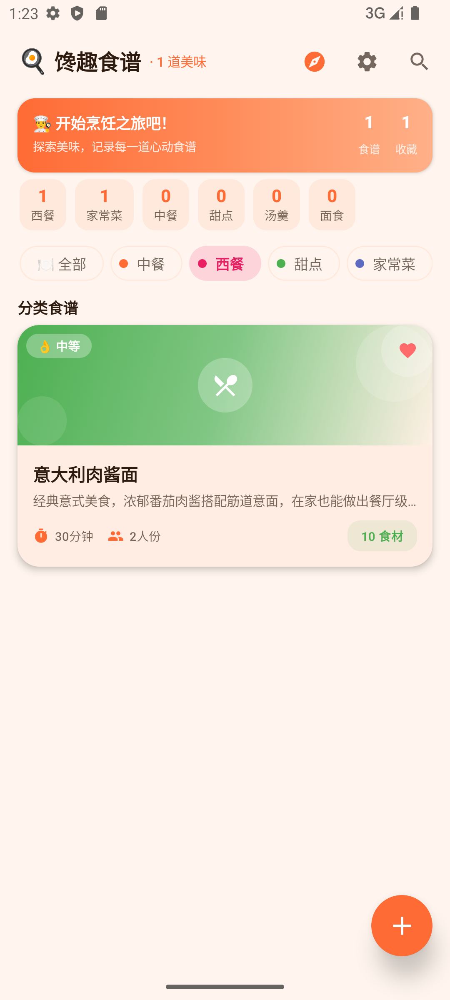
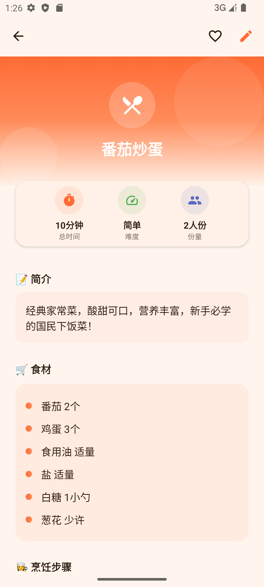
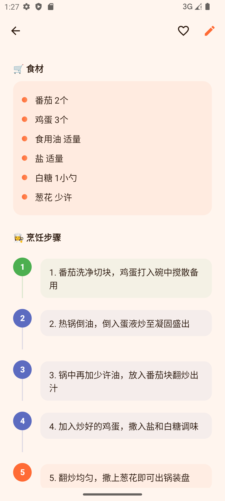
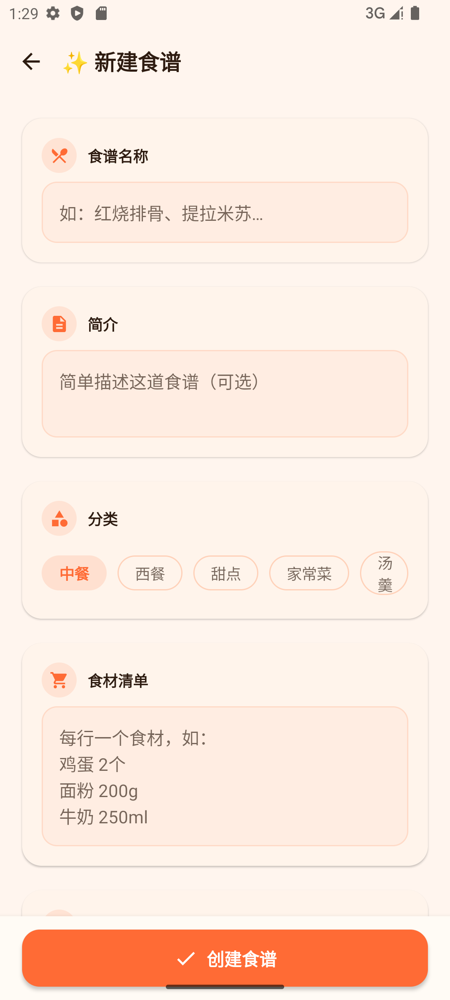
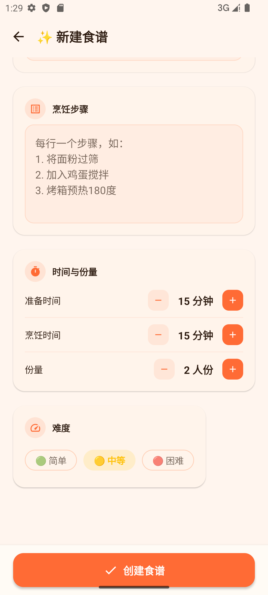
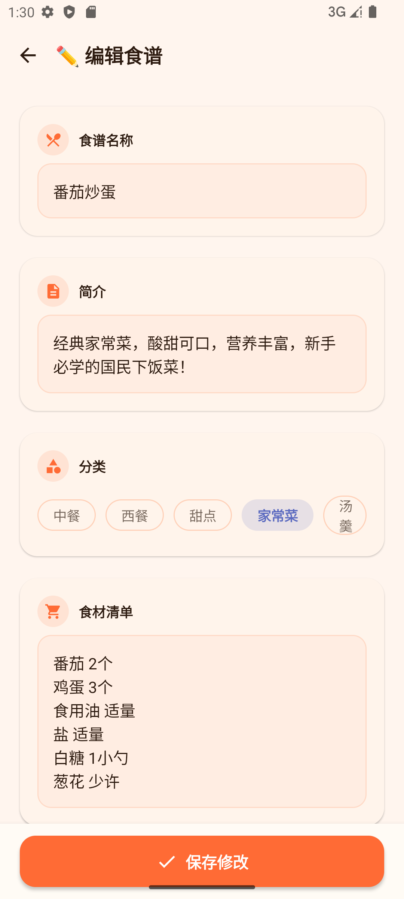
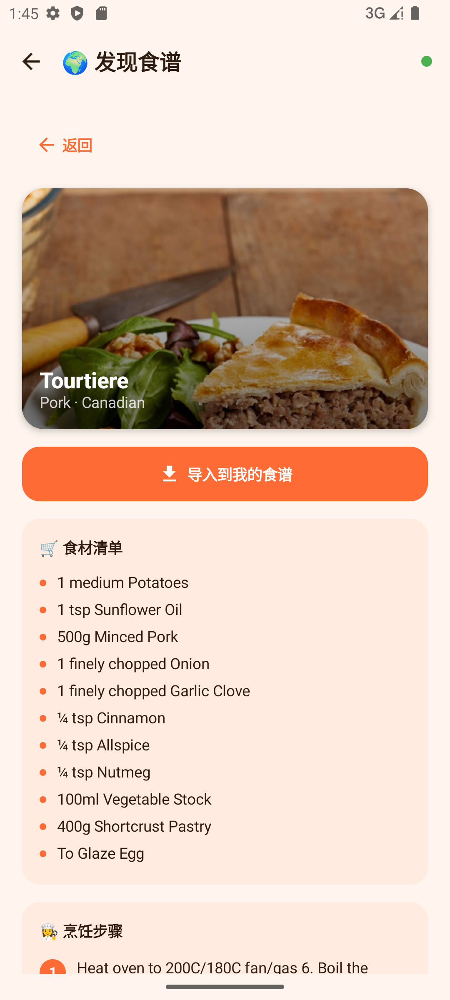
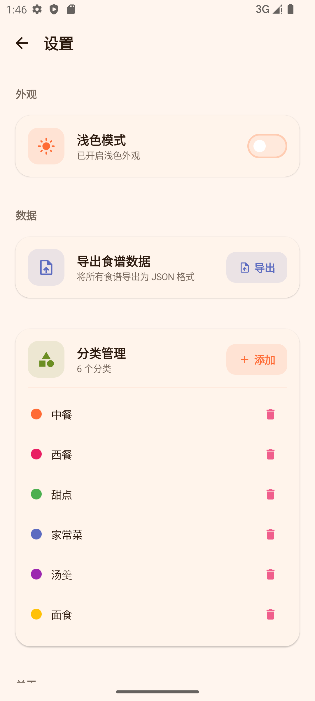
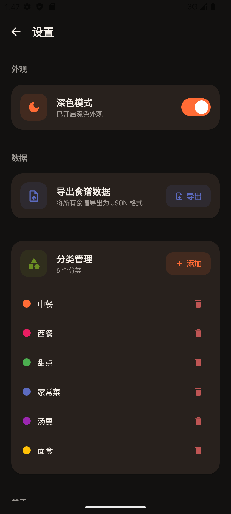

# 馋趣食谱 (Yummy Recipes) - 食谱管理应用

GitHub 仓库地址：https://github.com/zhu-s-112/MobileSoftwareDevelopment.git

## 1. 项目简介

- **应用名称**：馋趣食谱 (Yummy Recipes)
- **目标用户**：喜欢烹饪和收藏食谱的用户，希望便捷地管理个人食谱、获取灵感的烹饪爱好者
- **核心功能**：
  - 食谱浏览与搜索：支持关键词搜索和分类筛选
  - 食谱管理：新增、编辑、删除食谱，包含名称、分类、食材、步骤、图片等信息
  - 收藏管理：收藏喜欢的食谱便于快速查找
  - 在线发现：从 TheMealDB API 获取国际美食推荐，可一键导入本地
  - 深色模式：支持浅色/深色主题切换
  - 数据持久化：Room 数据库本地存储，DataStore 保存用户偏好
  - 分类管理：支持自定义分类及颜色标记
  - JSON 导出：食谱数据导出为 JSON 文件

## 2. 技术栈

- **语言**：Kotlin 1.9.22
- **构建工具**：Android Gradle Plugin 8.2.2 + KSP 1.9.22-1.0.17
- **UI**：Jetpack Compose + Material 3（BOM 2024.04.00，全部使用 Compose 构建，无 XML 布局）
- **数据库**：Room 2.6.1（2 张表：recipes + categories）
- **网络**：Retrofit 2.9.0 + OkHttp 4.12.0 + Gson（接口来源：TheMealDB API https://www.themealdb.com/）
- **状态管理**：ViewModel + StateFlow（1 个 RecipeViewModel 统一管理所有页面状态）
- **持久化偏好**：DataStore Preferences 1.0.0
- **导航**：Navigation Compose 2.7.6（6 个路由：首页、发现、详情、新增、编辑、设置）
- **异步处理**：Kotlin Coroutines
- **图片加载**：Coil 2.5.0 (AsyncImage)
- **其他依赖**：Material Icons Extended、Activity Compose 1.8.2

## 3. 功能清单

### 必做项完成情况

**UI 层**
- [x] Jetpack Compose 构建全部 UI
- [x] 至少 2 个主要页面（首页列表、发现页、详情页、添加/编辑页、设置页）
- [x] Compose Navigation 导航（底部导航栏 2 个 Tab + 设置齿轮图标 + 详情/编辑/新增路由）
- [x] LazyColumn 列表展示（首页食谱列表）、LazyRow 横向滑动（发现页推荐）
- [x] Material 3 组件（Card、Button、TextField、TopAppBar、FilterChip、Snackbar、Dialog、Switch、AlertDialog、DropdownMenu 等）
- [x] 浅色 / 深色模式支持（自定义暖橙色 Material 3 主题，包括颜色、字体）
- [x] 自定义主题颜色：主色暖橙 #FF6B35，辅助色橄榄绿 #6B8E23，肉桂色 #D2691E 等

**数据层**
- [x] Room 数据库，2 张表（recipes + categories）
- [x] 完整 CRUD 操作（插入、查询、更新、删除）
- [x] DAO 查询方法返回 Flow 类型
- [x] 至少一种查询功能（搜索、分类筛选、收藏筛选、分类统计 GROUP BY）
- [x] DataStore 保存用户偏好（深色模式开关）

**网络层**
- [x] 声明并使用 `INTERNET` 和 `ACCESS_NETWORK_STATE` 权限
- [x] 使用 Retrofit 从 TheMealDB 真实 API 获取食谱数据（4 个端点：随机、搜索、分类列表、分类筛选）
- [x] 网络数据在"发现"页面展示，并可一键导入保存到本地 Room 数据库
- [x] 处理 Loading / Success / Error 网络状态
- [x] 网络请求通过 Repository 封装，Composable 不直接发起
- [x] 实时网络状态监听，离线时显示提示

**架构层**
- [x] ViewModel 状态管理（1 个 RecipeViewModel 统一管理，Factory 手动依赖注入）
- [x] Repository 模式隔离数据源（RecipeRepository 封装 Room DAO + Retrofit ApiService）
- [x] StateFlow / Flow 数据流
- [x] Kotlin 协程异步处理
- [x] data class UiState 包含 20 个状态字段，涵盖加载/成功/错误/刷新/保存等各类状态
- [x] Composable 不直接访问数据库或网络

**功能完整性**
- [x] 新增、编辑、删除、搜索、分类筛选、收藏/取消收藏、导入网络食谱、JSON 导出（共 8 项核心操作）
- [x] 输入验证（食谱名称必填检查）和错误提示（Snackbar）
- [x] 状态展示（空状态、加载状态、错误状态、刷新状态、导入中状态等）
- [x] 屏幕旋转后状态保持（ViewModel + StateFlow 机制）

### 选做项完成情况

- [x] **Coil 图片加载**：使用 `AsyncImage` 加载网络食谱图片
- [x] **网络缓存**：从 TheMealDB 获取的食谱可一键保存到 Room 数据库，实现本地缓存
- [x] **搜索体验优化**：搜索防抖（300ms debounce），通过 Flow 的 `debounce` + `distinctUntilChanged` + `flatMapLatest` 实现
- [x] **复杂数据库查询**：模糊搜索（LIKE）、分类筛选、收藏筛选、分类统计（GROUP BY + COUNT）
- [x] **数据导出**：支持将食谱数据导出为 JSON 文件
- [x] **网络状态增强**：使用 `ConnectivityManager.NetworkCallback` 实时监听网络状态，离线时显示提示
- [x] **OkHttp 日志拦截器**：通过 `HttpLoggingInterceptor` 记录网络请求详情

## 4. 数据库设计

### 表 1：recipes（食谱表）

| 字段名 | 类型 | 说明 |
|---|---|---|
| id | Long | 主键，自增 |
| title | String | 食谱名称 |
| description | String | 简介/描述 |
| ingredients | String | 食材清单（分行文本） |
| steps | String | 烹饪步骤（分行文本） |
| categoryId | Long | 外键，关联 categories.id |
| imageUrl | String | 食谱图片 URL |
| prepTime | Int | 准备时间（分钟） |
| cookTime | Int | 烹饪时间（分钟） |
| servings | Int | 份数（默认2） |
| difficulty | Int | 难度（0=简单/1=中等/2=困难） |
| isFavorite | Boolean | 是否收藏 |
| createdAt | Long | 创建时间戳 |

### 表 2：categories（分类表）

| 字段名 | 类型 | 说明 |
|---|---|---|
| id | Long | 主键，自增 |
| name | String | 分类名称（如中餐、西餐、甜点） |
| color | Long | 分类颜色（ARGB Long 值） |
| icon | String | 图标标识 |

**表关系**：recipes 与 categories 是多对一关系，通过 categoryId 外键关联。分类表独立管理，支持用户自定义添加和删除分类。

**主要 DAO 查询方法（RecipeDao）**：
- `getAllRecipes()` → `Flow<List<RecipeEntity>>` - 获取所有食谱
- `searchRecipes(query)` - 模糊搜索（标题 LIKE 查询）
- `getRecipesByCategory(categoryId)` - 按分类筛选
- `getFavoriteRecipes()` - 获取收藏食谱
- `getRecipeById(id)` - 按 ID 获取单个食谱
- `getRecipeCountPerCategory()` - 分类统计（GROUP BY + COUNT），返回 `Flow<List<RecipeStat>>`

**主要 DAO 查询方法（CategoryDao）**：
- `getAllCategories()` → `Flow<List<CategoryEntity>>` - 获取所有分类
- `insertCategory(category)` - 新增分类
- `deleteCategory(category)` - 删除分类

## 5. 网络功能设计

- **API 来源**：TheMealDB (https://www.themealdb.com/) - 免费、开源的食谱数据库 API
- **Base URL**：https://www.themealdb.com/api/json/v1/1/
- **请求方式**：GET
- **主要接口（共 4 个）**：
  - `/random.php` - 获取随机食谱（发现页默认展示）
  - `/search.php?s=xxx` - 按名称搜索食谱
  - `/categories.php` - 获取全部分类列表
  - `/filter.php?c=xxx` - 按分类筛选食谱
- **主要返回字段**：idMeal、strMeal、strCategory、strArea、strInstructions、strMealThumb、strTags、strYoutube、strIngredient1~20、strMeasure1~20
- **App 中使用网络数据的页面**：
  - "发现"页面：展示随机推荐按钮（渐变横幅）和 8 宫格分类浏览入口，用户点击分类或搜索后显示食谱列表，可点击导入到本地 Room 数据库
- **网络状态监听**：通过 `ConnectivityManager.NetworkCallback` 实时监听网络可用性，离线时显示网络不可用提示
- **网络失败处理**：显示错误信息卡片和"重试"按钮；使用 OkHttp `HttpLoggingInterceptor` 记录请求/响应日志

## 6. 架构设计

```
UI Layer (Composable)
    ↓ collectAsState()
ViewModel Layer (RecipeViewModel: StateFlow<RecipeUiState>)
    ↓
Repository Layer (RecipeRepository)
    ↓                    ↓
Room DAO (本地数据)    Retrofit ApiService (网络数据)
RecipeDao + CategoryDao  MealApiService
    ↓                    ↓
SQLite Database         TheMealDB API
    +
DataStore Preferences (用户偏好: isDarkMode)
```

- **UI Layer**：5 个 Screen Composable + 1 个 RecipeCard 组件 + 1 个 EmptyState 组件，只负责界面渲染和事件分发，通过 `collectAsState()` 收集 ViewModel 的状态
- **ViewModel Layer**：1 个 `RecipeViewModel` 统一管理所有页面状态，`RecipeUiState` data class 包含 20 个状态字段（recipes、categories、discoverMeals、discoverRemoteMeal、isLoading、isDiscoverLoading、isNetworkAvailable、isDarkMode、isSaving、isImporting、isRefreshing、searchQuery、selectedCategoryId、recipeStats、totalRecipes、favoriteCount、saveSuccess、errorMessage、discoverError、editingRecipe），通过 Factory 手动依赖注入
- **Repository Layer**：`RecipeRepository` 封装 `RecipeDao`、`CategoryDao` 和 `MealApiService`，UI 层不需要知道数据来源
- **Data Layer**：Room 提供本地持久化（2 张表），Retrofit 提供网络数据（4 个 API 端点），DataStore 保存用户偏好
- **导航层**：`AppNavigation` 管理 6 个页面路由，单 Activity 架构

## 7. 页面结构与导航

应用共 6 个页面路由，通过 Jetpack Compose Navigation 管理：

| 路由 | 页面 | 说明 |
|---|---|---|
| `recipes` | 食谱列表（首页） | 展示本地食谱列表，支持搜索、分类筛选、下拉刷新 |
| `discover` | 发现页 | 网络食谱推荐，随机/分类浏览，一键导入本地 |
| `detail/{recipeId}` | 食谱详情 | 查看完整信息，收藏/取消收藏，编辑入口 |
| `add` | 新增食谱 | 填写名称、分类、食材、步骤、图片等表单 |
| `edit/{recipeId}` | 编辑食谱 | 编辑已有食谱信息 |
| `settings` | 设置页 | 深色模式切换，分类管理，JSON 导出，应用信息 |

底部导航栏 2 个 Tab：**食谱**（recipes）、**发现**（discover），设置页通过首页右上角齿轮图标进入

## 8. 核心功能截图

### 首页 - 食谱列表

说明：展示欢迎横幅（食谱总数+收藏数）、6个分类统计卡片（中餐/西餐/甜点/家常菜/汤羹/面食）、分类 FilterChip 筛选行、本地食谱卡片列表、右下角悬浮添加按钮

### 首页 - 分类筛选

说明：点击"西餐" FilterChip 后，列表仅显示对应分类的食谱（意大利肉酱面），顶部统计卡实时呼应

### 食谱详情 - 上半部分

说明：展示食谱标题、难度标签、图片区域、时间份量、简介描述、收藏按钮

### 食谱详情 - 食材步骤

说明：食材清单（圆点列表）和编号烹饪步骤，底部编辑和删除操作按钮

### 新增食谱 - 上半部分

说明：表单页面，包含食谱名称（必填）、简介描述输入、分类横向选择（6个FilterChip）

### 新增食谱 - 下半部分

说明：食材输入框、烹饪步骤输入框、准备时间/烹饪时间/份数数字选择器、难度选择、"创建食谱"保存按钮

### 编辑食谱

说明：编辑已有食谱（番茄炒蛋），表单预填所有数据，修改后点击"保存修改"更新食谱

### 发现 - 在线食谱

说明：随机获取食谱横幅（渐变色）、搜索框（支持按名称搜索）、"🌍 按分类浏览"标题、8宫格分类入口（牛肉/鸡肉/意面/海鲜/甜品/素食/早餐/汤羹）

### 发现 - 网络食谱详情

说明：展示从 TheMealDB API 获取的网络食谱详情（标题、图片、分类地区、食材清单、烹饪步骤），支持"导入到我的食谱"一键保存到本地 Room 数据库

### 设置页

说明：深色模式 Switch 切换、分类管理（新增/删除分类）、JSON 数据导出、应用信息展示

### 深色模式

说明：开启深色模式后的首页展示效果，背景和卡片均采用暗色调配色方案

## 9. 技术难点与解决方案

### 难点 1：TheMealDB API 食材数据的解析

- **问题描述**：TheMealDB API 返回的食材和用量数据使用 strIngredient1~20 和 strMeasure1~20 共 40 个独立字段，需要将其解析为结构化的食材列表
- **原因分析**：API 设计较早，使用扁平的字段结构而非嵌套数组
- **解决方案**：在 `MealResponse.kt` 网络响应模型中定义 `getIngredientPairs()` 方法，遍历 20 组字段并过滤空值，返回 `List<Pair<String, String>>`
- **参考资料**：TheMealDB API 官方文档

### 难点 2：Compose BOM 版本兼容性

- **问题描述**：项目编译通过但在运行时崩溃，抛出 `NoSuchMethodError: KeyframesSpec$KeyframesSpecConfig.at()` 异常，定位在 Material3 的 `CircularProgressIndicator` 组件
- **原因分析**：最初使用的 `compose-bom:2024.01.00` 中的动画 API 与 Material3 内部调用不兼容。BOM 2024.01.00 对应的 Compose UI 版本中 `KeyframesSpecConfig.at()` 方法签名与运行时依赖不匹配
- **解决方案**：将 Compose BOM 从 `2024.01.00` 升级到 `2024.04.00`，统一了所有 Compose 库的版本，确保动画 API 与 Material3 组件兼容。升级后 `CircularProgressIndicator` 正常工作
- **经验教训**：使用 BOM 管理 Compose 版本时，应确保 BOM 版本与 Kotlin 编译器版本相匹配。Kotlin 1.9.22 + Compose Compiler 1.5.8 与 BOM 2024.04.00 配合稳定

### 难点 3：新增食谱页面保存按钮不可见

- **问题描述**：新增/编辑食谱表单内容很多（名称、简介、分类、食材、步骤、准备时间、烹饪时间、份数、难度），保存按钮嵌入在 LazyColumn 滚动区域末尾，用户填完表单后看不到保存按钮
- **原因分析**：将按钮放在可滚动内容的末尾，用户需要滚动到底部才能看到，体验较差
- **解决方案**：将保存按钮从滚动列表中移出，作为 Scaffold 的 `bottomBar` 固定在屏幕底部，始终可见。同时保持验证逻辑不变
- **经验教训**：移动端表单设计应确保关键操作按钮（保存/提交）始终在屏幕可见区域

### 难点 4：份数计数器出现负数

- **问题描述**：份数选择器的 +/- 按钮步长曾设为 5，边界检查只判断当前值是否在范围内，而非加减后的结果。例如当前份数为 2 人份时点击减号，2 > 1 条件通过，但 2 - 5 = -3，显示负数
- **原因分析**：NumberRow 组件的减号逻辑为 `if (value > range.first) onChange(value - 5)`，没有验证 `value - 5` 是否仍 ≥ 范围最小值
- **解决方案**：两步修复：(1) 将步长从 5 改为 1，使数值变化更精准；(2) 修改边界检查为 `if (value > range.first) onChange(value - 1)`，确保不会越界。准备时间和烹饪时间也同步改为 ±1 步长
- **经验教训**：数字选择器必须验证计算结果在有效范围内，不能只检查当前值

### 难点 5：首页和发现页内容过长导致截图不完整

- **问题描述**：首页使用 LargeTopAppBar + 大尺寸欢迎横幅 + 统计数据 + 分类筛选项，食物列表卡片被挤到屏幕外；发现页的随机推荐卡(130dp) + 搜索框 + 8 宫格分类(200dp) 同样超出屏幕高度
- **原因分析**：过多装饰性元素和过大的间距占用了宝贵的屏幕空间，关键内容无法在第一屏完整显示
- **解决方案**：
  - 首页：食谱卡片渐变头从 150dp 缩到 110dp，图标从 68dp 缩到 50dp，内边距从 18dp 缩到 14dp，欢迎横幅紧凑化，统计卡内边距从 14x10 缩到 10x6，列表间距从 8dp 缩到 4dp
  - 发现页：随机推荐卡片从竖版改为横排紧凑版，搜索框独占全宽，分类网格上方添加 "🌍 按分类浏览" 小标题
  - 最终首页能同时完整显示约 2 道食谱卡片
- **经验教训**：移动端 UI 设计应遵循"内容优先"原则，装饰性元素应尽量紧凑，确保核心内容在第一屏可见

### 难点 6：FilterChip 边框冗余条件导致静态分析警告

- **问题描述**：IDE 报告 `Value of 'isSelected' is always false`，出现在两处 FilterChip 的 border 参数中
- **原因分析**：原代码使用 `border = if (!isSelected) { FilterChipDefaults.filterChipBorder(selected = isSelected, ...) } else null`，在 `!isSelected` 为 true 的分支中，`isSelected` 必然是 false，导致静态分析器报 warning
- **解决方案**：移除 `if/else null` 条件判断，让 FilterChip 始终显示边框：`border = FilterChipDefaults.filterChipBorder(selected = isSelected, ...)`，视觉效果不变且消除警告

### 难点 7：分类筛选不生效

- **问题描述**：首页点击 FilterChip（如"西餐"）后食谱列表不变，仍显示全部食谱
- **原因分析**：`selectCategory()` 方法只更新了 `selectedCategoryId` 变量，但没有根据分类 ID 重新过滤 `recipes` 列表
- **解决方案**：在 ViewModel 中新增 `_allRecipes` 缓存全部食谱，`selectCategory()` 调用 `filterByCategory()` 即时过滤。同时修复了搜索/清除搜索时未保持分类筛选的问题。分类 ID 语义重新定义：`-1`=全部，`0`=未分类，`>0`=具体分类

### 难点 8：发现页食谱详情返回按钮无效

- **问题描述**：在网络食谱详情页点击左上角"返回"箭头无反应，无法返回发现页列表
- **原因分析**：`DiscoverScreen.kt` 中 `onBack` 回调绑定的是 `viewModel.clearDiscoverError()`，该方法只清除错误信息，没有将 `discoverRemoteMeal` 设为 null，详情页状态仍然存在
- **解决方案**：将 `onBack` 改为调用 `viewModel.clearDiscoverResults()`，同时清除 `discoverMeals`、`discoverRemoteMeal` 和 `discoverError` 三个状态字段，确保正确关闭详情页。

## 10. AI 使用说明

请在以下选项中勾选，可多选：

- [ ] 未使用 AI
- [x] 网页版 AI（如 ChatGPT、Claude、Kimi、豆包等）
- [x] AI Agent / 编程代理（如 Claude Code、Codex、OpenCode、Cursor Agent 等）
- [ ] 国产大模型服务（如 DeepSeek、GLM、通义千问、文心一言等）
- [ ] IDE 插件或代码补全工具（如 GitHub Copilot、Cursor、CodeGeeX 等）
- [ ] 其他：

具体工具名称：CodeBuddy (AI Agent)

AI 主要用于哪些环节：
- 选题分析和架构设计
- 项目代码生成（Entity、DAO、Database、DTO、ApiService、Repository、ViewModel、UiState、Screen、Component 等 25 个 Kotlin 源文件）
- 调试与问题修复（BOM 版本兼容性、Material3 API 适配、网络权限配置、NumberRow 越界、FilterChip 静态分析、clickable 缺失、分类筛选不生效、发现页返回按钮无效等）
- UI 优化调整（首页/发现页布局紧凑化、保存按钮底部固定、欢迎横幅交互增强、去除未分类选项、发现页分类标题调整等）
- 报告模板和文档整理
- UI 美化和 Material 3 主题设计（暖橙色系主题配色）

说明：是否使用 AI 以及使用了什么 AI 工具不会影响分值，请如实填写。

## 11. 运行说明

- **最低 Android 版本**：API 26（Android 8.0）
- **目标/编译 SDK**：API 34（Android 14）
- **Java 版本**：Java 17 (sourceCompatibility & targetCompatibility)
- **特殊权限**：
  - `android.permission.INTERNET` - 网络访问（用于 API 请求和图片加载）
  - `android.permission.ACCESS_NETWORK_STATE` - 网络状态检测
- **运行步骤**：
  1. 克隆仓库：`git clone https://github.com/zhu-s-112/MobileSoftwareDevelopment.git`
  2. 使用 Android Studio Hedgehog (2023.1.1) 或更新版本打开项目
  3. 等待 Gradle 同步完成（需要下载 Compose BOM 2024.04.00 及 Kotlin 1.9.22 相关依赖）
  4. 连接模拟器或真机（API 26+），点击 Run

## 12. 项目亮点（可选）

1. **完整的 MVVM 架构**：UI、ViewModel、Repository、Data 四层分离清晰，RecipeUiState 统一管理 20 个状态字段
2. **网络与本地数据深度结合**：在线食谱可一键导入到本地，实现线上发现 + 本地管理的完整体验，支持离线缓存
3. **美观的 Material 3 设计**：自定义暖橙色食物主题色（primary #FF6B35），卡片式布局，圆角设计，8 色分类颜色标识
4. **完整的状态处理**：Loading / Success / Error / Empty / Saving / Importing / Refreshing 等 7 种以上状态反馈
5. **多维度查询与筛选**：支持关键词搜索（300ms 防抖）、分类筛选（FilterChip）、收藏筛选、分类统计（GROUP BY）
6. **数据导出功能**：支持将全部食谱导出为 JSON 格式，便于数据备份与迁移
7. **实时网络监听**：基于 `ConnectivityManager.NetworkCallback` 监听网络变化，离线时立即提示
8. **搜索防抖优化**：通过 Flow 的 `debounce(300ms)` + `distinctUntilChanged` + `flatMapLatest` 组合，避免频繁数据库查询
9. **底部固定保存按钮**：编辑页关键操作按钮通过 Scaffold bottomBar 始终可见，提升表单填写体验
10. **紧凑化布局设计**：首页和发现页经过多轮优化，确保核心内容在第一屏完整可见

## 13. 未来改进方向（可选）

1. **分页加载**：在线发现食谱支持分页和更多加载
2. **食材清单**：支持将食材导出为购物清单
3. **营养信息**：接入营养数据库 API，显示食谱的营养成分
4. **社交功能**：支持分享食谱给好友（ShareSheet）
5. **动画效果**：添加页面切换动画和列表项动画（AnimatedVisibility）
6. **依赖注入**：使用 Hilt 管理依赖，替代手动 Factory 注入
7. **单元测试**：为 ViewModel 和 Repository 编写单元测试
8. **数据库迁移**：Room 版本升级时的完整 Migration 策略
9. **食谱详情页优化**：添加烹饪计时器功能
10. **食材图片识别**：集成 CameraX 拍照识别食材
