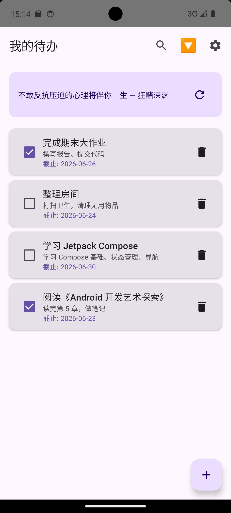
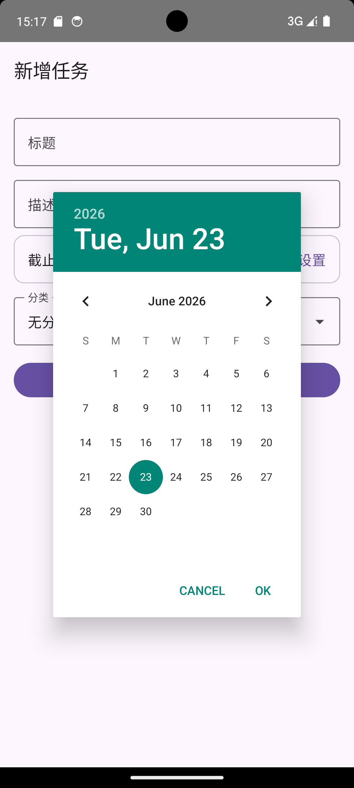
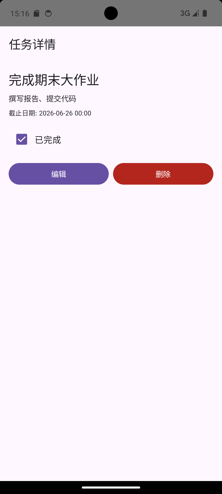
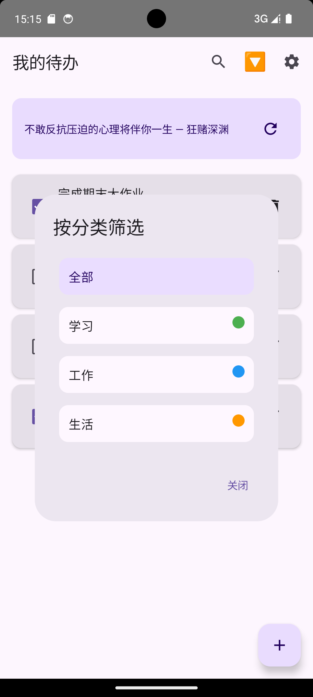

# 我的待办 - Android 任务管理应用

GitHub 仓库地址：[https://github.com/zs267/MobileSoftwareDevelopment]

---

## 1. 项目简介

- **应用名称**：我的待办（MyTodo）
- **目标用户**：需要管理日常任务、作业、生活计划的普通用户，尤其适合学生和上班族。
- **核心功能**：
  - 任务的增删改查、标记完成/未完成
  - 任务分类管理（工作、学习、生活）
  - 按标题/描述搜索任务
  - 按分类筛选任务
  - 每日一言（网络获取）
  - 显示/隐藏已完成任务（偏好保存）

---

## 2. 技术栈

| 类别 | 技术 |
|---|---|
| UI 框架 | Jetpack Compose + Material 3 |
| 数据库 | Room（SQLite） |
| 网络请求 | Retrofit + Gson + Kotlin Coroutines |
| 状态管理 | ViewModel + StateFlow |
| 偏好存储 | DataStore（Preferences） |
| 导航 | Navigation Compose |
| 异步处理 | Kotlin Coroutines（Flow、Suspend） |
| 图片加载 | 未使用（可选 Coil 预留） |
| 其他 | 日期选择器、对话框、Emoji 图标方案 |

---

## 3. 功能清单

### 必做项完成情况

**UI 层**
- [x] Jetpack Compose 构建全部 UI
- [x] 至少 2 个主要页面（列表、详情、编辑、设置共 4 个）
- [x] Compose Navigation 导航（`AppNavigation.kt`）
- [x] LazyColumn 展示任务列表
- [x] Material 3 组件：Card、Button、TextField、TopAppBar、FAB、Dialog、Switch、Checkbox
- [x] 自定义 Material 主题（颜色、字体）
- [x] 浅色 / 深色模式支持（跟随系统）

**数据层**
- [x] Room 数据库，2 张表（`Task` 和 `Category`）
- [x] 完整 CRUD 操作（增、删、改、查）
- [x] DAO 查询返回 `Flow<List<T>>` 和 `Flow<Int>`
- [x] 查询功能：按分类筛选、按关键词搜索、统计待办数量
- [x] DataStore 保存“显示已完成任务”开关和最近名言

**网络层**
- [x] 声明并实际使用 `INTERNET` 权限
- [x] 使用 Retrofit + 协程从真实 API（一言）获取每日名言
- [x] 名言展示在主界面，可手动刷新
- [x] 网络请求状态在 UiState 中体现（Loading / Success / Error）
- [x] 网络失败时显示友好的错误提示

**架构层**
- [x] ViewModel 管理 UI 状态（`TaskViewModel`）
- [x] 设计 `sealed interface` 表达 UiState（Loading / Success / Error）
- [x] Repository 模式（`TaskRepository`）隔离本地和网络数据
- [x] ViewModel 通过 Repository 访问数据
- [x] 使用 StateFlow 和 `collectAsStateWithLifecycle()` 收集状态
- [x] Composable 不直接访问数据库或网络

**功能完整性**
- [x] 新增、编辑、删除、标记完成、搜索、分类筛选
- [x] 输入验证（标题不能为空）
- [x] 空状态、加载状态、错误状态展示
- [x] 屏幕旋转后状态保持（ViewModel 支持）
- [x] 系统返回键返回上一页（Navigation 自动处理）

### 选做项完成情况

- [x] **搜索防抖**：在 ViewModel 中使用 `.debounce(300)` 实现搜索框防抖
- [x] **分类筛选**：通过下拉对话框按分类筛选任务
- [x] **复杂查询**：联合外键、分类统计、模糊搜索（LIKE）、按日期排序
- [ ] （如有其他选做，请补充）

---

## 4. 数据库设计

### 表 1：`categories`（分类表）

| 字段名 | 类型 | 说明 |
|---|---|---|
| id | Int | 主键，自增 |
| name | String | 分类名称（如“工作”） |
| color | Int | 分类颜色值（ARGB） |
| createdAt | Long | 创建时间戳 |

### 表 2：`tasks`（任务表）

| 字段名 | 类型 | 说明 |
|---|---|---|
| id | Int | 主键，自增 |
| title | String | 任务标题 |
| description | String? | 任务描述（可为空） |
| dueDate | Long? | 截止日期时间戳（可为空） |
| isCompleted | Boolean | 是否已完成 |
| categoryId | Int? | 外键，关联 `categories.id`，可为空 |
| createdAt | Long | 创建时间戳 |

**表关系**：`tasks.categoryId` 通过外键关联 `categories.id`，删除分类时任务 `categoryId` 自动设为 `NULL`。

**主要 DAO 查询**：
- `getAllTasks()`：按 `createdAt` 降序返回所有任务
- `getTasksByCategory(categoryId)`：按分类筛选
- `searchTasks(query)`：标题或描述中模糊匹配关键词
- `getPendingCount()`：统计 `isCompleted = 0` 的数量

---

## 5. 网络功能设计

- **API 来源**：一言（Hitokoto）公开 API
- **接口地址**：`https://v1.hitokoto.cn/?c=a`
- **请求方式**：GET
- **主要返回字段**：
  - `hitokoto`：名言内容
  - `from`：出处/作者
- **App 中使用场景**：首页顶部“每日一言”卡片
- **网络失败处理**：显示“获取名言失败，请稍后重试”提示，并保留上次成功加载的名言（DataStore 缓存）

> **说明**：原计划使用 `quotable.io` 但受网络证书限制，改为国内可用的“一言” API，确保功能正常。

---

## 6. 架构设计

采用标准的 MVVM + Repository 分层架构：

- **Data Layer**：
  - Room 数据库（本地持久化）
  - Retrofit（网络数据源）
- **Repository**（`TaskRepository`）：统一数据入口，组合本地数据库和网络请求。
- **ViewModel**（`TaskViewModel`）：持有 `StateFlow` 状态，通过 Repository 获取数据，处理业务逻辑（搜索防抖、筛选等）。
- **UI Layer**：Compose 界面通过 `collectAsStateWithLifecycle()` 订阅 ViewModel 的状态，并触发事件（如点击添加、删除）。

**优点**：界面与逻辑分离，便于测试和维护。

---

## 7. 核心功能截图

> **请替换以下占位图为实际截图路径，并简要说明。**

### 首页（任务列表 + 名言）
  
说明：展示所有任务，顶部显示每日名言，底部有 FAB 新增按钮。

### 新增任务
  
说明：包含标题、描述、截止日期选择、分类下拉。

### 任务详情
  
说明：显示完整信息，并提供编辑和删除按钮。

### 分类筛选
  
说明：点击筛选按钮弹出分类列表，选择后列表只显示该分类任务。

### 设置页
  
说明：切换“显示已完成任务”开关。

---

## 8. 技术难点与解决方案

### 难点 1：模拟器 HTTPS 证书错误导致网络请求失败

- **问题描述**：模拟器访问 `quotable.io` 报 `NET::ERR_CERT_DATE_INVALID`，导致名言无法加载。
- **原因分析**：模拟器系统时间与真实时间不同步，SSL 证书验证失败。
- **解决方案**：
  - 尝试 ADB 时间同步命令无效
  - 最终将 API 更换为国内可用的一言 API（`v1.hitokoto.cn`），绕过证书问题
- **参考资料**：一言 API 官方文档

### 难点 2：Compose 图标 `FilterList` 和 `Inbox` 无法导入

- **问题描述**：`import androidx.compose.material.icons.filled.FilterList` 报 `Unresolved reference`。
- **原因分析**：部分 Material Icon 扩展需要额外依赖或显式导入，项目环境可能未包含该图标包。
- **解决方案**：改用 Emoji 字符替代图标（🔽 表示筛选，📭 表示空状态），既简洁又避免依赖问题。

### 难点 3：新增页面导航失败（IllegalArgumentException）

- **问题描述**：点击 FAB 跳转新增页面时崩溃，报“Navigation destination not found”。
- **原因分析**：路由定义中 `task_edit/{taskId?}` 与传递的 `task_edit/` 不完全匹配。
- **解决方案**：将新增和编辑拆分为两个独立路由：`task_add`（无参数）和 `task_edit/{taskId}`（带参数），在 `AppNavigation` 中分别配置。

---

## 9. AI 使用说明

- [ ] 未使用 AI
- [x] 网页版 AI（如 ChatGPT、Claude、Kimi、豆包等）
- [x] AI Agent / 编程代理（如 Claude Code、Codex、OpenCode、Cursor Agent 等）
- [ ] 国产大模型服务（如 DeepSeek、GLM、通义千问、文心一言等）
- [ ] IDE 插件或代码补全工具（如 GitHub Copilot、Cursor、CodeGeeX 等）
- [ ] 其他：

**具体工具名称**：DeepSeek（网页版）

**AI 主要用于哪些环节**：
- 代码生成（初始项目结构、实体类、DAO、ViewModel、Compose 界面）
- 调试（定位编译错误、导航异常）
- 替换 API（从 quotable.io 切换到一言）
- 优化建议（搜索防抖、分类筛选）
- 报告整理（生成报告模板）

**说明**：AI 辅助提高了开发效率，所有代码经过手动调试和测试，确保最终应用稳定运行。

---

## 10. 运行说明

- **最低 Android 版本**：API 24（Android 7.0 Nougat）
- **推荐 Android 版本**：API 34（Android 14）
- **特殊权限**：`INTERNET`（网络权限）
- **运行步骤**：
  1. 克隆仓库：`git clone [你的仓库地址]`
  2. 使用 Android Studio（建议 Arctic Fox 或更新版本）打开项目
  3. 等待 Gradle 同步完成
  4. 连接模拟器或真机（建议 API 30+）
  5. 点击 Run 按钮（绿色三角形）

---

## 11. 项目亮点

1. **完整架构**：严格遵循 MVVM + Repository 模式，代码分层清晰，易于扩展。
2. **功能丰富**：除基础 CRUD 外，还实现了分类管理、截止日期、搜索防抖、分类筛选等高级功能。
3. **数据持久化**：Room 和 DataStore 分别管理数据与偏好，支持离线使用。
4. **网络集成**：成功对接真实 API 并处理加载/错误状态，具备实用价值。
5. **UI/UX**：Material 3 设计，深色模式适配，空状态、加载状态、错误提示完整，交互流畅。

---

## 12. 未来改进方向

- 添加下拉刷新（SwipeRefresh）
- 支持任务优先级和提醒通知
- 数据导出/导入（JSON）
- 完善分类管理（增删改分类）
- 添加统计图表（完成任务趋势）
- 单元测试覆盖 ViewModel 核心逻辑

---

*报告完成日期：2026 年 6 月 23 日*